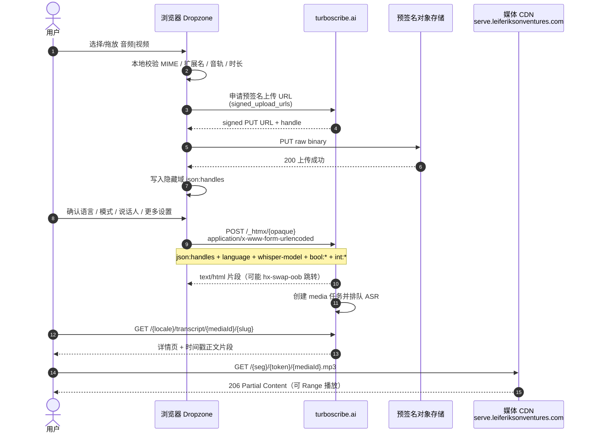

# 02 · 上传与转录（TurboScribe 主业务）

> **状态**：基于 2026-07-21 首页 SSR（`home.html`）+ 前端 JS 逆向 + 抓包整理  
> **用途**：科研对照 TurboScribe **核心业务链路**（上传媒体 → 配置设置 → 启动转录）  
> **合规**：仅本人账号、授权科研场景；Cookie / handle / opaque 一律占位；勿压测  
> **对应英文协议**：`docs/research/turboscribe-api-reference.md` §5.6  
> **主业务 UI 文案**：转录文件 · 音频/视频文件 · 音频语言 · 转录模式 · 说话人识别及更多设置

---

## 1. 业务概览

TurboScribe **没有**稳定的 `POST /api/v1/transcribe` REST，而是典型的 **「预签名对象存储上传 + HTMX 表单启动任务」** 两段式：

1. **本地校验**：Dropzone 按 MIME / 扩展名 / 音轨 / 时长等规则过滤文件  
2. **PUT 预签名**：拿到短时签名 URL 后，把原始二进制 `PUT` 到对象存储  
3. **POST `/_htmx/{opaque}`**：用表单字段提交 `json:handles` 与语言 / 模型 / 说话人等设置，**启动转录**

整条链路依赖 Cookie 会话；`/_htmx/{opaque}` 中的 opaque **随 build / 签名变化**，只能从页面 `hx-post` 现抓，不能当稳定公开 SDK。响应为 **HTML 片段**（可能整页 oob 跳转），不是 JSON `jobId`。

---

## 2. 端到端时序

### 2.1 Mermaid 时序图



### 2.2 文字时序

```
用户选择 / 拖放 音频|视频
        │
        ▼
┌───────────────────────────────────────┐
│ [1] 本地校验（Dropzone）                │
│  · MIME: audio/* / video/*             │
│  · 扩展名白名单                          │
│  · require-audio-track / require-duration│
└───────────────────────────────────────┘
        │ 通过
        ▼
┌───────────────────────────────────────┐
│ [2] 申请预签名 URL                      │
│  · runtime: dropzone$signed_upload_urls│
│  · 返回 PUT URL + handle                │
└───────────────────────────────────────┘
        │
        ▼
┌───────────────────────────────────────┐
│ [3] PUT {binary} → 预签名存储 URL       │
│  · method: PUT                         │
│  · binaryBody: true                    │
│  · 成功后 handle 写入隐藏域 json:handles │
└───────────────────────────────────────┘
        │
        ▼
┌───────────────────────────────────────┐
│ [4] 用户确认设置                         │
│  · 音频语言 language                     │
│  · 转录模式 whisper-model                │
│  · 说话人 / 更多设置 bool:* / int:*      │
└───────────────────────────────────────┘
        │
        ▼
┌───────────────────────────────────────┐
│ [5] POST /_htmx/{opaque}  启动转录      │
│  Content-Type: application/x-www-form-urlencoded │
│  Body: json:handles + language + …     │
└───────────────────────────────────────┘
        │
        ▼
┌───────────────────────────────────────┐
│ [6] 服务端创建 media 任务                 │
│  · 仪表盘出现「处理中」                   │
└───────────────────────────────────────┘
        │
        ▼
┌───────────────────────────────────────┐
│ [7] 完成后                              │
│  · GET /{locale}/transcript/{mediaId}/{slug} │
│  · GET /_content/htmx/…  时间戳正文      │
│  · GET serve…/{token}/{mediaId}.mp3    │
└───────────────────────────────────────┘
```

---

## 3. 三步详解

### 3.1 步骤一：本地校验

入口：首页主表单内的 Dropzone（文案：**转录文件 / 音频·视频文件**）。

| 项 | 说明 |
|----|------|
| 库 | Dropzone 6（站点第三方 CDN） |
| MIME | `audio/*`、`video/*`（以及细粒度 MIME，见 §5） |
| 扩展名 | 白名单（见 §5）；不在列表则「不能上传此类型」 |
| 约束标志（样本） | `require-audio-track`、`require-duration`、`skip-checksums`、`disable-auto-deletion` |
| 常见错误文案 | 该文件为空 / 不能上传此类型 / 缺少音轨 / 文件过大 / 文件过多 / 无效媒体 / 正在处理视频… |
| 大视频实验（样本） | `scribe_uploader_discard_video_tracks_1_to_2_gib_2026_06_26`：1–2 GiB 量级可丢弃视频轨只留音频 |

**通过本地校验后才会申请预签名 URL**；校验失败不会产生 `json:handles`。

### 3.2 步骤二：PUT 预签名上传

**不要**把文件 multipart 到 `/_htmx`。媒体走独立对象存储：

```http
PUT {signed-upload-url}
Content-Type: {file-mime 或 application/octet-stream}
Body: <raw binary>
```

| 项 | 值 |
|----|-----|
| 方法 | `PUT` |
| body | 原始二进制（`binaryBody: true`） |
| URL 来源 | runtime `w$dropzone$signed_upload_urls`（短时有效） |
| 成功后 | 前端把 **handle 数组** 写入隐藏域 `json:handles`（`required`） |

`json:handles` 逻辑形状（**非固定 schema**，以抓包为准）：

```json
[
  {
    "handle": "REDACTED",
    "name": "meeting.mp3",
    "size": 14400618,
    "type": "audio/mpeg"
  }
]
```

表单编码后：

```http
json:handles=%5B%7B%22handle%22%3A%22REDACTED%22%2C%22name%22%3A%22meeting.mp3%22%7D%5D
```

### 3.3 步骤三：POST `/_htmx/{opaque}` 提交设置

首页主表单（SSR 实测形态）：

```html
<form
  hx-post="/_htmx/{opaque-folder-id-window-dropzone-automatically-create-account}"
  hx-page-load-indicator="true">

  <!-- ① 已上传文件句柄（PUT 成功后写入，required） -->
  <input name="json:handles" required autocomplete="off"/>

  <!-- ② 音频语言 -->
  <select name="language">…</select>

  <!-- ③ 转录模式（三选一 radio，默认 large-v2） -->
  <input type="radio" name="whisper-model" value="base"/>      <!-- 猎豹 Cheetah -->
  <input type="radio" name="whisper-model" value="small"/>     <!-- 海豚 Dolphin -->
  <input type="radio" name="whisper-model" value="large-v2" checked/> <!-- 鲸 Whale 默认 -->

  <!-- ④ 说话人识别及更多设置 -->
  <input type="checkbox" name="bool:diarize?"/>
  <select name="int:num-speakers">…</select>
  <input type="checkbox" name="bool:translate-to-english?"/>
  <input type="checkbox" name="bool:clean-up-audio?"/>

  <!-- 可选描述（部分入口/版本可见） -->
  <input/textarea name="description"/>
</form>
```

样本 opaque（**会失效**，仅示形状）：

```text
/_htmx/yTTV3gAEkpMBzQKqlwcAwAHDAsOTqWZvbGRlci1pZLB3aW5kb3ctZHJvcHpvbmU_vWF1dG9tYXRpY2FsbHktY3JlYXRlLWFjY291bnQ_
```

路径尾部 base64 语义片段：

| base64 | 解码 |
|--------|------|
| `Zm9sZGVyLWlk` | `folder-id` |
| `d2luZG93LWRyb3B6b25l` | `window-dropzone` |
| `YXV0b21hdGljYWxseS1jcmVhdGUtYWNjb3VudD8` | `automatically-create-account?` |

| 请求属性 | 值 |
|----------|-----|
| 方法 | `POST` |
| Content-Type | `application/x-www-form-urlencoded` |
| 鉴权 | Cookie（`access-token` 等，文档用 `REDACTED`） |
| 推荐头 | `Origin` / `Referer` / `x-lev-xhr;` / `x-turbolinks-loaded;` |
| 成功响应 | `text/html` 片段；可能 `hx-swap-oob` 跳转仪表盘/文件夹 |
| **不是** | JSON `{jobId}`；mediaId 出现在后续列表 HTML 的 `/transcript/{mediaId}/…` 链接中 |

副入口（最终仍汇入 handles + 同一套设置）：

| UI | 形态 | 说明 |
|----|------|------|
| 拖放/选文件 | `hx-post /_htmx/…dropzone-id…` | Dropzone 生命周期、签 URL |
| 录音 | 弹窗 + 同 dropzone 管线 | `aria-label="录音"` |
| 从链接导入 | `hx-post /_htmx/…` 弹窗 | YouTube 等 URL → 服务端拉取 |
| 匿名上传 | 路径含 `automatically-create-account?` | 无账号也可开户并转录 |

---

## 4. 字段总表（主业务请求 body）

提交到 `POST /_htmx/{opaque}` 的表单字段：

| # | UI 文案 | 字段名 | 类型 | 必填 | 取值 / 说明 |
|---|---------|--------|------|------|-------------|
| 1 | **转录文件 / 音频·视频文件** | `json:handles` | JSON 字符串 | **是** | 预签名 PUT 成功后的 handle 数组；空则无法提交（`required`） |
| 2 | **音频语言** | `language` | string | 是（有默认） | **英文枚举**，见 §6；样本默认 `Chinese (Simplified)` |
| 3 | **转录模式** | `whisper-model` | enum | 是 | `base` \| `small` \| `large-v2`；默认 **`large-v2`** |
| 4 | **识别说话人** | `bool:diarize?` | checkbox | 否 | 勾选后分段标注说话人 |
| 5 | **有多少说话人？** | `int:num-speakers` | int | 条件 | 仅 diarize 开启时有效：`2`…`8` 或 **`-1`=自动检测** |
| 6 | **转录为英语** | `bool:translate-to-english?` | checkbox | 否 | 将原始音频语言直接转录为英语 |
| 7 | **恢复音频** | `bool:clean-up-audio?` | checkbox | 否 | 差音质兜底（降噪/增强），更慢；文案建议仅作最后手段 |
| 8 | （可选描述） | `description` | string | 否 | 备注/描述；可用于改善专有名词识别（产品侧曾强调元数据有用） |

**命名风格（Clojure/EDN 风格）**：

- `bool:…?` → 布尔  
- `int:…` → 整型  
- `json:…` → JSON 编码字符串  

**Checkbox 规则**：未勾选时通常 **不出现在 body**；勾选后由浏览器按 HTML checkbox 规则提交（常见值为 `on`，或服务端约定真值）。

---

## 5. 音频 / 视频文件

### 5.1 MIME 与扩展名

| 类别 | 内容 |
|------|------|
| MIME 通配 | `audio/*`、`video/*` |
| 文案列举格式 | `MP3, MP4, M4A, MOV, AAC, WAV, OGG, OPUS, MPEG, WMA, WMV` |
| Dropzone `accepted-files`（首页 SSR 摘要） | 音频：`.mp3 .m4a .wav .ogg .flac .aac .mid .midi .aiff .aif .aifc .opus .wma .ra .ac3 .amr .mpga` 及 `audio/mpeg`、`audio/x-m4a`、`audio/webm`、`audio/alac`…；视频：`.mp4 .m4b .webm .ogv .avi .mov .mkv .flv .m4v .3gp .wmv .ts .mts .vob` 及 `video/mp4`、`video/quicktime`、`video/x-matroska`… |
| 扩展白名单（更广，runtime/rpc） | `mp3, mp4, m4a, m4b, m4v, mov, aac, wav, ogg, oga, ogv, opus, mpeg, mpga, wma, wmv, flac, webm, mkv, mk3d, mka, aif, aiff, aifc, amr, caf, mid, midi, ra, trm, ts, mts, m2ts, ac3, qt, …` |

> 公开营销页还会提到 AVI、ALAC、3GP、RMVB、DivX 等「更多格式」；**以 Dropzone 白名单 + 实际上传结果为准**。

### 5.2 额度（Free / Unlimited）

公开定价会变更，以下为产品侧常见声明：

| 档位 | 单文件 | 并发上传 | 其它 |
|------|--------|----------|------|
| **Free** | ≤ **30 分钟** | **1** 个文件 | 每日免费次数（样本营销：**3 次/天**）；队列优先级较低 |
| **Unlimited** | ≤ **10 小时** / **5 GB** | 最多 **50** 个文件 | 更高优先级；营销称无限存储 |

免费额度与队列策略以账户页/定价页实时文案为准。

---

## 6. 音频语言（`language`）

```html
<select name="language" class="dui3-select …">
  <!-- 分组：流行 / 高精度更多 / 其他语言 -->
  <!-- option 的 value 为英文枚举；展示为本地化文案 + 旗帜 -->
</select>
```

要点：

- **提交值**是英文名（如 `Chinese (Simplified)`），**不是** BCP-47（`zh-CN`）  
- 样本默认选中：`Chinese (Simplified)`（UI：简体中文）  
- option 数量样本约 **109**；产品宣传 **98+** 语言  

### 6.1 流行组（样本）

| value（提交） | UI（zh-CN） |
|---------------|-------------|
| `English` | 英语 |
| `English (US)` | 英语（美国） |
| `English (UK)` | 英语（英国） |
| `Spanish` | 西班牙语 |
| `Portuguese` | 葡萄牙语 |
| `French` | 法语 |
| `Italian` | 意大利语 |
| `German` | 德语 |
| `Dutch` | 荷兰语 |
| `Polish` | 波兰语 |
| `Danish` | 丹麦语 |
| `Japanese` | 日语 |
| `Korean` | 韩语 |
| `Hungarian` | 匈牙利语 |
| `Czech` | 捷克语 |
| `Chinese` | 中文 |
| `Hebrew` | 希伯来语 |

### 6.2 完整列表节选（首页 SSR）

**高精度语言更多**：  
`Arabic`, `Azerbaijani`, `Estonian`, `Belarusian`, `Bulgarian`, `Icelandic`, `Bosnian`, `Persian`, `Russian`, `Chinese (Traditional)`, `Finnish`, `Kazakh`, `Galician`, `Catalan`, `Chinese (Simplified)`, `Kannada`, `Croatian`, `Latvian`, `Lithuanian`, `Romanian`, `Marathi`, `Malay`, `Macedonian`, `Maori`, `Afrikaans`, `Nepali`, `Norwegian`, `Swedish`, `Serbian`, `Slovak`, `Slovenian`, `Swahili`, `Tagalog`, `Tamil`, `Thai`, `Turkish`, `Welsh`, `Urdu`, `Ukrainian`, `Greek`, `Armenian`, `Hindi`, `Indonesian`, `Vietnamese`

**其他语言**：  
`Albanian`, `Amharic`, `Assamese`, `Occitan`, `Valencian`, `Bashkir`, `Basque`, `Breton`, `Tibetan`, `Faroese`, `Sanskrit`, `Flemish`, `Khmer`, `Georgian`, `Gujarati`, `Haitian Creole`, `Haitian`, `Hausa`, `Castilian`, `Latin`, `Lao`, `Lingala`, `Luxembourgish`, `Malagasy`, `Maltese`, `Malayalam`, `Mongolian`, `Bengali`, `Myanmar`, `Burmese`, `Moldovan`, `Punjabi`, `Pashto`, `Sinhala`, `Shona`, `Somali`, `Tajik`, `Tatar`, `Telugu`, `Turkmen`, `Uzbek`, `Hawaiian`, `Nynorsk`, `Sindhi`, `Sundanese`, `Yiddish`, `Yoruba`, `Javanese`

完整列表以页面 `<option value>` 为准。

---

## 7. 转录模式（`whisper-model`）

UI 三档 ↔ 字段 ↔ Whisper（官博 *Transcription Modes, Explained* + 首页 SSR）：

| UI（zh-CN） | 英文产品名 | 图标语义 | `whisper-model` | Whisper | 速度（约 1h 音） | 定位 |
|-------------|------------|----------|-----------------|---------|------------------|------|
| **猎豹** | Cheetah | 最快 | `base` | base ~74M | ~20–30s | 尽快出稿 |
| **海豚** | Dolphin | 均衡 | `small` | small ~244M | ~2–3 min | 高准确仍快 |
| **鲸** | Whale | 最准（**默认**） | `large-v2` | large-v2 ~1.55B | &lt;10 min | 默认最高准确 |

```html
<input type="radio" name="whisper-model" value="base"/>
<input type="radio" name="whisper-model" value="small"/>
<input type="radio" name="whisper-model" value="large-v2" checked/>
```

使用建议（产品侧）：优先 **Whale / `large-v2`** 求准；赶时间再降到 Dolphin / Cheetah。

---

## 8. 说话人识别及更多设置

| UI | 字段 | 交互 / 语义 |
|----|------|-------------|
| **识别说话人** | `bool:diarize?` | checkbox；「为转录的每个部分标注说话人」 |
| **有多少说话人？** | `int:num-speakers` | diarize 开启后显示；`required` |
| **转录为英语** | `bool:translate-to-english?` | 「直接将原始音频语言转录为英语」 |
| **恢复音频** | `bool:clean-up-audio?` | AI 去噪/增强；「建议仅在音频质量较差的文件中作为最后的手段使用」 |

### 8.1 说话人数量

```html
<select name="int:num-speakers" required>
  <option value="2">2 个说话人</option>
  <option value="3">3 个说话人</option>
  <option value="4">4 个说话人</option>
  <option value="5">5 个说话人</option>
  <option value="6">6 个说话人</option>
  <option value="7">7 个说话人</option>
  <option value="8">8 个说话人</option>
  <option value="-1">自动检测</option>
</select>
```

| 值 | 含义 |
|----|------|
| `2` … `8` | 固定说话人数量 |
| **`-1`** | **自动检测**（产品提示：可能高估人数） |

未勾选 `bool:diarize?` 时，说话人选择区隐藏；`int:num-speakers` 一般不必提交。

---

## 9. 完整逻辑 curl 示例

> **说明**：opaque、预签名 URL、handle 必须从页面 / Network **现抓**；下方均为占位。  
> **禁止**把真实 `access-token` 写入仓库或外传。

```bash
# 0) 会话 Cookie（全部 REDACTED）
export TS_COOKIE='access-token=REDACTED; session-secret=REDACTED; device-token=REDACTED; fingerprint=REDACTED; snowflake=REDACTED; lev=1; js=1; i18n-activated-languages=zh-CN%2Cen'

# 1) 预签名 PUT（SIGNED_UPLOAD_URL 来自 signed_upload_urls，此处占位）
export SIGNED_UPLOAD_URL='https://OPAQUE_SIGNED_STORAGE_HOST/OPAQUE_PATH'

curl -sS -X PUT "$SIGNED_UPLOAD_URL" \
  -H 'Content-Type: audio/mpeg' \
  --data-binary @meeting.mp3

# 2) 启动转录（主业务 POST /_htmx/{opaque}）
curl -sS 'https://turboscribe.ai/_htmx/OPAQUE_FROM_hx-post' \
  -X POST \
  -H "Cookie: $TS_COOKIE" \
  -H 'Origin: https://turboscribe.ai' \
  -H 'Referer: https://turboscribe.ai/zh-CN/' \
  -H 'Content-Type: application/x-www-form-urlencoded' \
  -H 'x-lev-xhr;' \
  -H 'x-turbolinks-loaded;' \
  --data-urlencode 'json:handles=[{"handle":"REDACTED","name":"meeting.mp3","size":1234567,"type":"audio/mpeg"}]' \
  --data-urlencode 'language=Chinese (Simplified)' \
  --data-urlencode 'whisper-model=large-v2' \
  --data-urlencode 'bool:diarize?=on' \
  --data-urlencode 'int:num-speakers=-1' \
  --data-urlencode 'bool:clean-up-audio?=on'
  # 未勾选的 checkbox（如 bool:translate-to-english?）不要传
  # 可选：--data-urlencode 'description=周会录音'
```

**预期响应**：`200 text/html` 片段（可能带 `hx-swap-oob` 整页导航），**不是** JSON job 对象。后续在仪表盘 HTML 中找：

```text
/{locale}/transcript/{mediaId}/{slug}
```

再按需拉：

```http
GET /_content/htmx/{opaque}?vid=…&language=zh-CN&etag=…&e=…&s=…
GET https://serve.leiferiksonventures.com/{seg}/{token}/{mediaId}.mp3
```

---

## 10. 字段 ↔ 产品功能速查表

| 产品功能 | 请求字段 / 步骤 |
|----------|-----------------|
| 转录文件（上传） | Dropzone 本地校验 → PUT 预签名 → 写入 `json:handles` |
| 音频 / 视频文件 | MIME `audio/*` `video/*` + 扩展白名单；额度 Free 30 分 / Unlimited 10h·5GB |
| 音频语言 | `language`（英文枚举，流行组 + 98+ / 样本 ~109 options） |
| 转录模式 | `whisper-model` = `base`（猎豹）/ `small`（海豚）/ `large-v2`（鲸，默认） |
| 识别说话人 | `bool:diarize?` + `int:num-speakers`（`2`–`8` 或 `-1` 自动） |
| 转录为英语 | `bool:translate-to-english?` |
| 恢复音频（去噪） | `bool:clean-up-audio?` |
| 可选描述 | `description` |
| 从链接导入 / 录音 | 独立 HTMX 弹窗，最终仍汇入 handles + 同上设置 |
| 开始转录 | `POST /_htmx/{opaque}` 提交整表 |
| 查看结果 | `GET /{locale}/transcript/{mediaId}/{slug}` + `/_content/htmx/…` |
| 播放原音频 | 签名 CDN `serve.leiferiksonventures.com/.../{mediaId}.mp3` |

---

## 11. 科研对照注意

1. **字段名相对稳定**（`json:handles` / `language` / `whisper-model` / `bool:diarize?` 等）；**opaque 路径与签名 URL 极不稳定**。  
2. 对照 Happy-TTS / 公开 Whisper API 时，只映射 **功能语义与枚举**，不要硬编码 opaque。  
3. 会话 Cookie = 账号控制权；预签名 PUT URL 与媒体 capability token 等同临时写/读权限。  
4. 自动化请限速；完整 document 导航易遇 Cloudflare 403，同源 HTMX POST 相对友好。  

---

## 12. 修订记录

| 日期 | 说明 |
|------|------|
| 2026-07-21 | 中文章节润色增强：吸收 §5.6 + 首页 SSR 字段/语言表/额度，补全 mermaid/文字双时序、三步详解、完整 curl 与速查表 |
