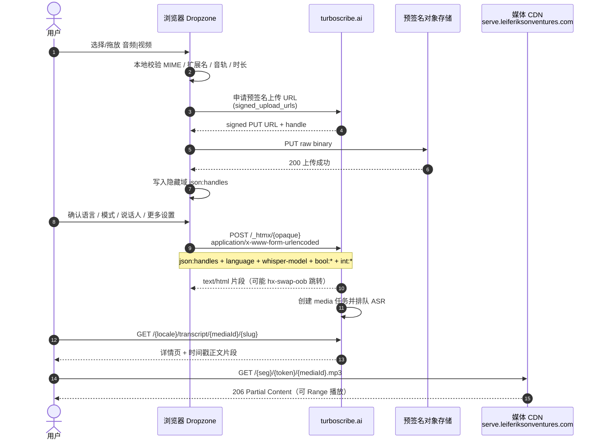

# TurboScribe 接口研究文档（中文完整版）

> 由分册自动合并 · 2026-07-21 · 科研对照用 · 非官方 API · 凭据一律 REDACTED

---

# TurboScribe 接口研究文档（中文版）

> **状态**：2026-07-21 基于前端 JS 逆向 + 鉴权抓包整理  
> **用途**：科研项目功能/协议对照，**非官方公开 API**  
> **合规**：仅限本人账号与授权科研；Cookie/签名 URL 一律 REDACTED；勿高频压测

## 文档结构

| 文件 | 内容 |
|------|------|
| [01-协议与鉴权.md](./01-协议与鉴权.md) | 架构、域名、Cookie、HTMX/json-rpc、opaque 解码 |
| [02-上传与转录.md](./02-上传与转录.md) | **主业务**：文件 / 语言 / 模式 / 说话人 / 更多设置 |
| [03-文件管理与导出.md](./03-文件管理与导出.md) | 打开/导出/分享/下载/重命名/删除/文件夹/CDN |
| [04-产品功能与科研对照.md](./04-产品功能与科研对照.md) | 套餐、功能总表、与公开 ASR 对照 |

英文/混合底稿（更全的探测附录）：

- `../turboscribe-api-reference.md`
- `../turboscribe-public-features.md`
- `../turboscribe-probe-results.md`
- `../turboscribe-cdn-url-analysis.md`

## 主业务一句话

```
音频/视频 → 预签名 PUT → POST /_htmx
  body: json:handles + language + whisper-model
      + bool:diarize? + int:num-speakers
      + bool:translate-to-english? + bool:clean-up-audio?
```

| UI | 字段 |
|----|------|
| 转录文件 | Dropzone + `json:handles` |
| 音频语言 | `language` |
| 转录模式 | `whisper-model` = base/small/large-v2 |
| 说话人识别 | `bool:diarize?` + `int:num-speakers` |
| 更多设置 | 译英 / 恢复音频 / description |

详见 [02-上传与转录.md](./02-上传与转录.md)。

---

# 01 · 协议与鉴权

> **状态**：基于 2026-07-21 前端 JS 逆向、浏览器抓包与有限鉴权探测整理  
> **用途**：科研项目功能/协议对照，**非官方公开 API**  
> **合规**：仅限本人账号与授权科研场景；勿传播会话 Cookie / access-token；勿对目标做高频压测  
> **局限**：TurboScribe **无**公开 REST/OpenAPI。业务操作走 **HTMX 不透明路径 + 服务端渲染 HTML**，路径 token 随构建/会话变化，不能当作稳定公开 SDK

相关中间产物：

| 文件 | 说明 |
|------|------|
| `docs/research/turboscribe-api-reference.md` | 英文总参考（协议、字段、业务动作） |
| `docs/research/turboscribe-probe-results.md` | 基础设施与 Cloudflare 探测 |
| `docs/research/turboscribe-cdn-url-analysis.md` | 媒体 CDN URL 与签名模型 |
| `docs/research/turboscribe-public-features.md` | 公开产品功能对照（若存在） |
| `docs/research/turboscribe-js/` | HTML/HTMX/runtime 样本（含敏感 Cookie 的原始头文件请勿外传） |

---

## 1. 总体架构

TurboScribe **不是**典型的 `/api/v1/...` JSON REST 服务，而是 **Leif Erikson Ventures 自研 full-stack 前端**：

- **CLJS 编译**的 `runtime.js`（版本化路径下发）
- **HTMX** 驱动业务动作与片段交换
- **Turbolinks** 负责页面内导航（XHR 换页）

```
Browser
  │  Cookie 会话鉴权
  ├─ HTML 页面导航 (Turbolinks XHR；头：x-lev-xhr / x-turbolinks-loaded)
  ├─ POST /_htmx/{opaque}          ← 业务动作（建夹/导出/重命名/删除/启动转录…）
  ├─ GET  /_content/htmx/{opaque}  ← 片段 HTML（转录正文、懒加载 UI）
  ├─ POST /_levscript/json         ← 客户端调用/遥测日志（transit-like JSON）
  ├─ POST /_fp                     ← 浏览器指纹上报
  ├─ Dropzone 预签名 PUT 上传      ← 原始媒体
  └─ GET  serve.leiferiksonventures.com/{sig}/{token}/{id}.mp3  ← 签名媒体流
```

要点：

| 维度 | 说明 |
|------|------|
| 调用面 | HTML 片段 + 不透明路径，**非**稳定 JSON 资源 |
| 鉴权 | 首方 Cookie 会话；媒体侧为 **路径内 capability token** |
| 结果形态 | `text/html`（可含 `hx-swap-oob`、`application/json-rpc` 内联脚本） |
| 路径稳定性 | `{opaque}` 随 build/签名过期变化，**只作协议形状参考** |

构建指纹（样本，会变更）：

| 项 | 样本值 |
|----|--------|
| `build-id` | `88cfdeda-acbb-4605-9cea-a6d188d37d51` |
| `revision-id` | `64f83ccc5bac277603b4e51b1c4dc348db049410` |
| 主包 | `/_content/versioned/{build-id}/js/apps/web/runtime.js` |

---

## 2. 域名表

| 层 | 域名 | 角色 |
|----|------|------|
| App | `turboscribe.ai` | 页面、HTMX、内容分发、鉴权 Cookie；主业务入口 |
| Content twin | `content.leiferiksonventures.com` | 静态/内容（runtime 中引用） |
| Media | `serve.leiferiksonventures.com` | 签名音频/视频流（Cloudflare 边缘 + 对象存储源） |
| Analytics host | `{hash}.turboscribe.ai` | GA 等分析代理（CSP `frame-src` 中可见） |

补充（探测结论，非业务必需）：

| 主机 | 备注 |
|------|------|
| `www.turboscribe.ai` | 与 apex 同 Cloudflare anycast |
| `api.turboscribe.ai` / `app.turboscribe.ai` | DNS 可达，但无公开 OpenAPI；自动化客户端多遇 CF 挑战 |
| `leiferiksonventures.com` | 与 `turboscribe.ai` 共享 Cloudflare NS / 邮件栈形态，组织级基础设施关联 |

媒体 URL 形态（见 CDN 分析文档）：

```text
https://serve.leiferiksonventures.com/{path_segment}/{capability_token}/{numeric_id}.mp3
```

App 侧亦可出现同源签名直链：

```text
GET /_content/id/{mediaId}.mp3?s={sig}
```

---

## 3. Cookie 鉴权字段表

> **示例值一律写 `REDACTED`。禁止把真实 token / Cookie 写入仓库或公开文档。**

### 3.1 首方 Cookie

| Cookie | 作用（推断） | 鉴权相关 | 备注 |
|--------|--------------|----------|------|
| `access-token` | 登录访问令牌 | **核心** | 短字符串；持有即等同账号会话能力 |
| `session-secret` | 会话密钥 | **核心** | 与 CSRF/签名相关 |
| `device-token` | 设备标识 | 高 | 长期设备绑定 |
| `fingerprint` | 浏览器指纹摘要 | 高 | 与 `POST /_fp` 上报配合 |
| `snowflake` | 客户端实例 id | 中 | base64url 形态 |
| `lev` | 产品/平台标记 | 低 | 样本为 `1` |
| `js` / `webp` / `avif` | 能力探测 | 否 | 非鉴权 |
| `screen-width` / `screen-height` / `window-*` / `device-pixel-ratio` / `time-zone` | 客户端环境 | 否 | 非鉴权 |
| `i18n-activated-languages` | 语言偏好 | 否 | 如 `zh-CN,en` |
| `hwm-*` | 短时 WAF/会话边车 | 边车 | 约 5s 过期，`HttpOnly` + `Secure`；动态响应常刷新 |
| 第三方 `_ga*` / `_fbp` / `_twpid` 等 | 分析像素 | 否 | 业务鉴权不依赖 |

文档/脚本中的占位示例（**仅形状，无真实值**）：

```text
access-token=REDACTED
session-secret=REDACTED
device-token=REDACTED
fingerprint=REDACTED
snowflake=REDACTED
lev=1
js=1
i18n-activated-languages=zh-CN%2Cen
```

### 3.2 常见响应头（鉴权/调试）

| 响应头 | 含义 |
|--------|------|
| `x-viewer: {numeric_id}` | 当前登录用户/视图 id（snowflake 整型字符串） |
| `x-pod` / `x-pid` / `x-rt` / `x-tid` | K8s 源站调试信息（pod 名、进程、耗时等） |
| `Set-Cookie: hwm-…` | 每次动态响应可能刷新边车 Cookie |

### 3.3 最小鉴权 curl 模板

```bash
export TS_COOKIE='access-token=REDACTED; session-secret=REDACTED; device-token=REDACTED; fingerprint=REDACTED; snowflake=REDACTED; lev=1; js=1; i18n-activated-languages=zh-CN%2Cen'

curl -sS 'https://turboscribe.ai/_htmx/OPAQUE' \
  -X POST \
  -H "Cookie: $TS_COOKIE" \
  -H 'Content-Type: application/json' \
  -H 'Content-Length: 0' \
  -H 'Origin: https://turboscribe.ai' \
  -H 'Referer: https://turboscribe.ai/zh-CN/dashboard' \
  -H 'x-lev-xhr;' \
  -H 'x-turbolinks-loaded;' \
  -H 'User-Agent: Mozilla/5.0 …'
```

---

## 4. 请求头

业务 XHR / HTMX / Turbolinks 导航推荐携带：

| 请求头 | 形态 | 说明 |
|--------|------|------|
| `Cookie` | 见 §3 | 会话鉴权主体 |
| `Origin` | `https://turboscribe.ai` | 同源业务 POST 常用 |
| `Referer` | 如 `https://turboscribe.ai/zh-CN/dashboard` | 页面上下文；媒体请求亦常带 `https://turboscribe.ai/` |
| `User-Agent` | 浏览器 UA | 自动化探测对完整 document 更易触发 CF 挑战 |
| `x-lev-xhr` | **无值头**（`x-lev-xhr;`） | runtime 对同源 XHR 自动注入 |
| `x-turbolinks-loaded` | **无值头**（`x-turbolinks-loaded;`） | Turbolinks 已加载标记 |
| `x-lev-prefetched` | 无值头（可选） | 预取导航时出现 |
| `turbolinks-referrer` | 上一页 URL | Turbolinks 导航时 |

抓包说明：

- `x-lev-xhr` 与 `x-turbolinks-loaded` 在抓包中为 **Header 名存在、值为空** 的形式（`Header;`）。
- 完整 document 导航在部分自动化环境会被 Cloudflare **403 Managed Challenge**；**同源 HTMX POST** 在带有效 Cookie 时更易得到 `200`。
- 媒体 CDN 请求通常 **不** 依赖 App Cookie，而依赖路径内签名 token；常附带 `Range`、`sec-fetch-dest: audio`、`Referer`。

HTTP 示例：

```http
Cookie: access-token=REDACTED; session-secret=REDACTED; device-token=REDACTED; fingerprint=REDACTED; snowflake=REDACTED; lev=1; js=1; …
Origin: https://turboscribe.ai
Referer: https://turboscribe.ai/zh-CN/dashboard
User-Agent: Mozilla/5.0 …
x-lev-xhr;
x-turbolinks-loaded;
```

---

## 5. 协议端点

### 5.1 `POST /_htmx/{opaque}` — 业务动作

| 项 | 说明 |
|----|------|
| 方法 | 多数 `POST`；部分懒加载为 `GET` |
| 路径 | `{opaque}` 为压缩/签名的服务端 handler 引用，**不可手写语义**；从页面 `hx-post` / `hx-get` 读取 |
| Content-Type | 空 body 触发：`application/json` + `Content-Length: 0`；表单：`application/x-www-form-urlencoded` 或 multipart |
| 响应 | `text/html; charset=utf-8` 片段；可含 `hx-swap-oob`、`hx-noswap:`、内联 `application/json-rpc` |
| 鉴权 | 需要 Cookie；成功响应常带 `x-viewer` |

查询参数（部分动作）：

| 参数 | 含义 |
|------|------|
| `vid` | viewer id，与 `x-viewer` 一致 |
| `e` | 过期时间戳（毫秒级，签名有效期） |
| `s` | 请求签名 |
| `language` | 如 `zh-CN` |
| `etag` | 片段缓存校验 |
| `_pf` | 预取/页面指纹 |

### 5.2 `GET /_content/htmx/{opaque}` — 内容片段

用于转录正文等可缓存片段：

```http
GET /_content/htmx/{opaque}?vid=…&language=zh-CN&etag=…&e=…&s=… HTTP/1.1
Host: turboscribe.ai
Cookie: access-token=REDACTED; …
x-lev-xhr;
```

| 项 | 说明 |
|----|------|
| 响应 | `200 text/html`，含带时间戳的转录 span |
| 缓存 | 常见 `Cache-Control: public,max-age=31557600,…immutable` + `cf-cache-status: HIT` |
| DOM 要点 | `#transcript-{mediaId}`、`#audio-{mediaId}`、`data-start`/`data-end`（毫秒）、`data-timestamp`；内联 json-rpc 绑定滚动/时间戳控件 |

### 5.3 `POST /_levscript/json` — 客户端调用/遥测

```http
POST /_levscript/json HTTP/1.1
Host: turboscribe.ai
Content-Type: text/plain
Origin: https://turboscribe.ai
Cookie: …
```

Body 为 transit-like 嵌套数组，常见字段语义：

- `invocations`
- `title` / `url` / `referrer` / `counter`
- `build-id` / `process-id` / `revision-id`
- 偶发浏览器 `warning`（如第三方像素参数错误）

**用途**：前端运行时遥测 / 错误回传，**不是**转录业务 API。路径相对稳定。

### 5.4 `POST /_fp` — 浏览器指纹

```http
POST /_fp HTTP/1.1
Content-Type: text/plain
Content-Encoding: gzip
```

Body 逻辑形状：

```json
{
  "thumbmark": {
    "audio": "…",
    "canvas": "…",
    "fonts": "…",
    "hardware": "…",
    "locales": "…",
    "math": "…",
    "permissions": "…",
    "plugins": "…",
    "screen": "…",
    "system": "…",
    "webgl": "…"
  }
}
```

对应 Cookie `fingerprint` 更新。路径相对稳定。

### 5.5 其它首方端点（对照）

| 路径 | 说明 |
|------|------|
| `POST /_cloudflare_turnstile_verify/` | Turnstile 校验（runtime 引用） |
| `POST /_googleonetaplogin/` | Google One Tap |
| `GET /_content/versioned/{build}/…` | 版本化 JS/CSS |
| `GET /_content/i18n/{build}/{lang}/translations.js` | 翻译包 |
| `GET /_content/hashed/{hash}.{ext}?cr=1&s=…` | 签名静态资源 |
| `GET /_content/id/{mediaId}.mp3?s=…` | 同源签名音频直链（下载按钮） |
| `GET /_content/thirdparty/…` | 代理的 CDN 依赖（plyr、dropzone、turbolinks…） |
| `GET /robots.txt` / `GET /__sitemap.xml` | 公开站点发现（无鉴权） |

---

## 6. `application/json-rpc` 内联脚本

SSR 页面与 HTMX 响应中大量出现：

```html
<script type="application/json-rpc">[[0,668,[9,0],[9,1],[7,2,true,3,[9,4]]],["transcript-…","audio-…",…]]</script>
```

行为说明：

| 项 | 说明 |
|----|------|
| 扫描 | runtime 扫描 `script[type='application/json-rpc']` |
| 注册 | 解码后经 `invoke_fn_id` 注册到 `c$rpc$_registered_rpcs` |
| 本质 | **内联 bootstrap 指令**（DOM 绑定、控件初始化、滚动/seek 等） |
| 非标准 | **不是** JSON-RPC 2.0 over HTTP（无 `jsonrpc`/`method`/`id` 标准信封） |
| 与业务关系 | 不替代 `/_htmx` 动作；是片段 HTML 的客户端挂载协议 |

科研对照时：把 `application/json-rpc` 视为 **SSR/HTMX 响应的一部分**，而非独立可编程 RPC 端点。

---

## 7. Opaque 路径中的 base64 语义解码表

`/_htmx/{opaque}` 与 `/_content/htmx/{opaque}` 中的 opaque 不可手写，但尾部/内嵌常含 **base64 业务键片段**，解码后可理解意图（字段名级，非完整 handler 语义）。

| 路径中 base64 片段 | 解码（UTF-8） | 语义 |
|--------------------|---------------|------|
| `bWVkaWEtaWQ` | `media-id` | 单媒体资源 |
| `bWVkaWEtaWRz` | `media-ids` | 多媒体（导出等批量语义） |
| `YWJicmV2aWF0ZWQ` | `abbreviated` | 缩略/简版菜单态 |
| `ZWRpdGluZw` | `editing` | 编辑态（文件菜单等） |
| `Zm9sZGVyLWlk` | `folder-id` | 文件夹 |
| `ZHJvcHpvbmUtaWQ` | `dropzone-id` | Dropzone 上传区生命周期 |
| `d2luZG93LWRyb3B6b25l` | `window-dropzone` | 窗口级拖放区 |
| `YXV0b21hdGljYWxseS1jcmVhdGUtYWNjb3VudD8` | `automatically-create-account?` | 匿名上传可自动开户 |
| `aW50ZXJ2YWw` | `interval` | 计费周期 |
| `bW9udGhseQ` | `monthly` | 月付 |
| `bnVtYmVyLW9mLXNlYXRz` | `number-of-seats` | 席位数 |
| `Y291cG9u` | `coupon` | 优惠码 |

与 **说话人识别（diarize）** 相关的键多出现在 **表单字段**（而非 opaque base64 表），科研对照时一并记录：

| 表单字段 | 类型 | 语义 |
|----------|------|------|
| `bool:diarize?` | checkbox | 开启说话人识别 |
| `int:num-speakers` | int | 说话人数量：`2`…`8`，或 `-1` 自动检测 |
| `whisper-model` | enum | `base` / `small` / `large-v2` |
| `language` | string | 音频语言（英文枚举，如 `Chinese (Simplified)`） |
| `bool:translate-to-english?` | checkbox | 源语言直接转录为英语 |
| `bool:clean-up-audio?` | checkbox | 音频恢复/降噪兜底 |
| `json:handles` | JSON 字符串 | 预签名 PUT 成功后的上传句柄数组 |
| `description` | string | 可选备注 |

命名风格：Clojure/EDN 风格。`bool:…?` 为布尔，`int:…` 为整型，`json:…` 为 JSON 编码字符串。未勾选的 checkbox 通常 **不出现在 body**。

解码方法（科研）：

1. 从 HTML 提取 `hx-post` / `hx-get` 完整路径  
2. 对 opaque 中可识别的 base64url/base64 片段做解码  
3. 对照上表得到 `media-id`、`folder-id` 等意图  
4. **不要**尝试伪造签名段 `e` / `s` 或完整 opaque

---

## 8. Cloudflare / 403 探测限制说明

基于 2026-07-21 被动探测（短超时、单路径、无鉴权滥用）：

### 8.1 边缘与挑战

| 主机族 | 行为 |
|--------|------|
| `*.turboscribe.ai`（apex/www/api/app） | 多数 HTML/“API 形”路径对自动化客户端返回 **403** + `cf-mitigated: challenge`（“Just a moment…”） |
| `serve.leiferiksonventures.com` | **非**浏览器挑战页；裸路径多为 **401** 纯文本 `Invalid URL.` |

### 8.2 公开可达（无 Cookie）

| 路径 | 状态 | 说明 |
|------|------|------|
| `GET /robots.txt` | 200 | 允许抓取；指向 `__sitemap.xml` |
| `GET /__sitemap.xml` | 200 | 营销/应用路由站点地图 |
| 常见 `/api`、`/openapi.json`、`/swagger`、`/graphql`、`/health` | 403 挑战或不可得 | **无**公开 OpenAPI |

### 8.3 对科研抓包的含义

| 场景 | 观察 |
|------|------|
| 完整 document 导航 | 本机自动化环境更易 403 Managed Challenge |
| 同源 HTMX POST + 有效 Cookie + `x-lev-xhr` | 更易 200 |
| 媒体 CDN 裸路径 | 401/无效路径失败关闭；需完整签名 URL |
| 合成假 token 的三段媒体路径 | 常 500（路由命中后校验失败），非成功路径 |

### 8.4 探测约束（必须遵守）

- 超时短、每路径极少请求、**禁止**挑战绕过 / 撞库 / 高频扫描  
- 媒体研究优先 `HEAD` / `Range: bytes=0-0`，避免整文件下载  
- PowerShell/`curl` 注意 UA 与 Cookie；403 时不要暴力重试  
- 无公开 REST 文档时，以 **授权浏览器会话 + Network 抓包** 为主，而非扫端口

---

## 9. 合规声明

1. **非官方 API**：本文档描述的是私有 Web 协议逆向与探测结论，**不构成** TurboScribe 官方集成接口，路径与签名随时可能失效。  
2. **授权范围**：仅可在**本人账号**、**书面/明示授权**的科研对照场景使用；禁止未授权访问他人数据。  
3. **密钥与会话**：`access-token`、`session-secret`、设备/指纹 Cookie、媒体 capability URL 等同凭证；**禁止**提交 git、公开 issue、聊天或截图外传。文档中示例一律 `REDACTED`。  
4. **签名媒体 URL**：持有完整 URL ≈ 临时读权限；勿传播、勿写入多租户日志明文。  
5. **限速与 ToS**：自动化必须限速，遵守 Cloudflare 与站点服务条款；禁止挑战绕过与压测。  
6. **用途边界**：科研功能/字段语义对照；若需可编程生产接入，应走官方渠道或自建 ASR 栈（如本仓库 Synapse），**勿**依赖 opaque 路径做生产集成。  
7. **修订性**：逆向结论随发版失效；以抓包当日 HTML/`hx-*` 为准，opaque 样本不可复用为长期 API。

---

## 附录 A · 功能 → 协议形态速查

| 产品功能 | 接口形态 | 稳定性 |
|----------|----------|--------|
| 打开仪表盘 | `GET /{locale}/dashboard` | 路径模式稳定，需 Cookie，易遇 CF |
| 打开转录 | `GET /{locale}/transcript/{id}/{slug}` | 路径模式稳定 |
| 加载转录文本 | `GET /_content/htmx/{opaque}?vid&language&etag&e&s` | opaque/签名不稳；内容可 CDN 缓存 |
| 播放/下载音频 | `serve…/{seg}/{token}/{id}.mp3` 或 `/_content/id/{id}.mp3?s=` | 签名 URL 时效 |
| 新建文件夹 | `POST /_htmx/{opaque}` + `name=` | opaque 不稳 |
| 上传并转录 | Dropzone PUT + 表单 POST | 预签名 URL 短时 |
| 导出/分享/重命名/删除 | `POST /_htmx/…` | opaque 不稳 |
| 客户端日志 | `POST /_levscript/json` | 路径稳定，非业务 |
| 指纹 | `POST /_fp` | 路径稳定 |

---

## 附录 B · 修订记录

| 日期 | 说明 |
|------|------|
| 2026-07-21 | 中文章节初版：协议架构、域名、Cookie/请求头、端点、json-rpc、opaque base64、CF 限制与合规声明 |

---

# 02 · 上传与转录（TurboScribe 主业务）

> **状态**：基于 2026-07-21 首页 SSR（`home.html`）+ 前端 JS 逆向 + 抓包整理  
> **用途**：科研对照 TurboScribe **核心业务链路**（上传媒体 → 配置设置 → 启动转录）  
> **合规**：仅本人账号、授权科研场景；Cookie / handle / opaque 一律占位；勿压测  
> **对应英文协议**：`docs/research/turboscribe-api-reference.md` §5.6  
> **主业务 UI 文案**：转录文件 · 音频/视频文件 · 音频语言 · 转录模式 · 说话人识别及更多设置

---

## 1. 业务概览

TurboScribe **没有**稳定的 `POST /api/v1/transcribe` REST，而是典型的 **「预签名对象存储上传 + HTMX 表单启动任务」** 两段式：

1. **本地校验**：Dropzone 按 MIME / 扩展名 / 音轨 / 时长等规则过滤文件  
2. **PUT 预签名**：拿到短时签名 URL 后，把原始二进制 `PUT` 到对象存储  
3. **POST `/_htmx/{opaque}`**：用表单字段提交 `json:handles` 与语言 / 模型 / 说话人等设置，**启动转录**

整条链路依赖 Cookie 会话；`/_htmx/{opaque}` 中的 opaque **随 build / 签名变化**，只能从页面 `hx-post` 现抓，不能当稳定公开 SDK。响应为 **HTML 片段**（可能整页 oob 跳转），不是 JSON `jobId`。

---

## 2. 端到端时序

### 2.1 Mermaid 时序图



### 2.2 文字时序

```
用户选择 / 拖放 音频|视频
        │
        ▼
┌───────────────────────────────────────┐
│ [1] 本地校验（Dropzone）                │
│  · MIME: audio/* / video/*             │
│  · 扩展名白名单                          │
│  · require-audio-track / require-duration│
└───────────────────────────────────────┘
        │ 通过
        ▼
┌───────────────────────────────────────┐
│ [2] 申请预签名 URL                      │
│  · runtime: dropzone$signed_upload_urls│
│  · 返回 PUT URL + handle                │
└───────────────────────────────────────┘
        │
        ▼
┌───────────────────────────────────────┐
│ [3] PUT {binary} → 预签名存储 URL       │
│  · method: PUT                         │
│  · binaryBody: true                    │
│  · 成功后 handle 写入隐藏域 json:handles │
└───────────────────────────────────────┘
        │
        ▼
┌───────────────────────────────────────┐
│ [4] 用户确认设置                         │
│  · 音频语言 language                     │
│  · 转录模式 whisper-model                │
│  · 说话人 / 更多设置 bool:* / int:*      │
└───────────────────────────────────────┘
        │
        ▼
┌───────────────────────────────────────┐
│ [5] POST /_htmx/{opaque}  启动转录      │
│  Content-Type: application/x-www-form-urlencoded │
│  Body: json:handles + language + …     │
└───────────────────────────────────────┘
        │
        ▼
┌───────────────────────────────────────┐
│ [6] 服务端创建 media 任务                 │
│  · 仪表盘出现「处理中」                   │
└───────────────────────────────────────┘
        │
        ▼
┌───────────────────────────────────────┐
│ [7] 完成后                              │
│  · GET /{locale}/transcript/{mediaId}/{slug} │
│  · GET /_content/htmx/…  时间戳正文      │
│  · GET serve…/{token}/{mediaId}.mp3    │
└───────────────────────────────────────┘
```

---

## 3. 三步详解

### 3.1 步骤一：本地校验

入口：首页主表单内的 Dropzone（文案：**转录文件 / 音频·视频文件**）。

| 项 | 说明 |
|----|------|
| 库 | Dropzone 6（站点第三方 CDN） |
| MIME | `audio/*`、`video/*`（以及细粒度 MIME，见 §5） |
| 扩展名 | 白名单（见 §5）；不在列表则「不能上传此类型」 |
| 约束标志（样本） | `require-audio-track`、`require-duration`、`skip-checksums`、`disable-auto-deletion` |
| 常见错误文案 | 该文件为空 / 不能上传此类型 / 缺少音轨 / 文件过大 / 文件过多 / 无效媒体 / 正在处理视频… |
| 大视频实验（样本） | `scribe_uploader_discard_video_tracks_1_to_2_gib_2026_06_26`：1–2 GiB 量级可丢弃视频轨只留音频 |

**通过本地校验后才会申请预签名 URL**；校验失败不会产生 `json:handles`。

### 3.2 步骤二：PUT 预签名上传

**不要**把文件 multipart 到 `/_htmx`。媒体走独立对象存储：

```http
PUT {signed-upload-url}
Content-Type: {file-mime 或 application/octet-stream}
Body: <raw binary>
```

| 项 | 值 |
|----|-----|
| 方法 | `PUT` |
| body | 原始二进制（`binaryBody: true`） |
| URL 来源 | runtime `w$dropzone$signed_upload_urls`（短时有效） |
| 成功后 | 前端把 **handle 数组** 写入隐藏域 `json:handles`（`required`） |

`json:handles` 逻辑形状（**非固定 schema**，以抓包为准）：

```json
[
  {
    "handle": "REDACTED",
    "name": "meeting.mp3",
    "size": 14400618,
    "type": "audio/mpeg"
  }
]
```

表单编码后：

```http
json:handles=%5B%7B%22handle%22%3A%22REDACTED%22%2C%22name%22%3A%22meeting.mp3%22%7D%5D
```

### 3.3 步骤三：POST `/_htmx/{opaque}` 提交设置

首页主表单（SSR 实测形态）：

```html
<form
  hx-post="/_htmx/{opaque-folder-id-window-dropzone-automatically-create-account}"
  hx-page-load-indicator="true">

  <!-- ① 已上传文件句柄（PUT 成功后写入，required） -->
  <input name="json:handles" required autocomplete="off"/>

  <!-- ② 音频语言 -->
  <select name="language">…</select>

  <!-- ③ 转录模式（三选一 radio，默认 large-v2） -->
  <input type="radio" name="whisper-model" value="base"/>      <!-- 猎豹 Cheetah -->
  <input type="radio" name="whisper-model" value="small"/>     <!-- 海豚 Dolphin -->
  <input type="radio" name="whisper-model" value="large-v2" checked/> <!-- 鲸 Whale 默认 -->

  <!-- ④ 说话人识别及更多设置 -->
  <input type="checkbox" name="bool:diarize?"/>
  <select name="int:num-speakers">…</select>
  <input type="checkbox" name="bool:translate-to-english?"/>
  <input type="checkbox" name="bool:clean-up-audio?"/>

  <!-- 可选描述（部分入口/版本可见） -->
  <input/textarea name="description"/>
</form>
```

样本 opaque（**会失效**，仅示形状）：

```text
/_htmx/yTTV3gAEkpMBzQKqlwcAwAHDAsOTqWZvbGRlci1pZLB3aW5kb3ctZHJvcHpvbmU_vWF1dG9tYXRpY2FsbHktY3JlYXRlLWFjY291bnQ_
```

路径尾部 base64 语义片段：

| base64 | 解码 |
|--------|------|
| `Zm9sZGVyLWlk` | `folder-id` |
| `d2luZG93LWRyb3B6b25l` | `window-dropzone` |
| `YXV0b21hdGljYWxseS1jcmVhdGUtYWNjb3VudD8` | `automatically-create-account?` |

| 请求属性 | 值 |
|----------|-----|
| 方法 | `POST` |
| Content-Type | `application/x-www-form-urlencoded` |
| 鉴权 | Cookie（`access-token` 等，文档用 `REDACTED`） |
| 推荐头 | `Origin` / `Referer` / `x-lev-xhr;` / `x-turbolinks-loaded;` |
| 成功响应 | `text/html` 片段；可能 `hx-swap-oob` 跳转仪表盘/文件夹 |
| **不是** | JSON `{jobId}`；mediaId 出现在后续列表 HTML 的 `/transcript/{mediaId}/…` 链接中 |

副入口（最终仍汇入 handles + 同一套设置）：

| UI | 形态 | 说明 |
|----|------|------|
| 拖放/选文件 | `hx-post /_htmx/…dropzone-id…` | Dropzone 生命周期、签 URL |
| 录音 | 弹窗 + 同 dropzone 管线 | `aria-label="录音"` |
| 从链接导入 | `hx-post /_htmx/…` 弹窗 | YouTube 等 URL → 服务端拉取 |
| 匿名上传 | 路径含 `automatically-create-account?` | 无账号也可开户并转录 |

---

## 4. 字段总表（主业务请求 body）

提交到 `POST /_htmx/{opaque}` 的表单字段：

| # | UI 文案 | 字段名 | 类型 | 必填 | 取值 / 说明 |
|---|---------|--------|------|------|-------------|
| 1 | **转录文件 / 音频·视频文件** | `json:handles` | JSON 字符串 | **是** | 预签名 PUT 成功后的 handle 数组；空则无法提交（`required`） |
| 2 | **音频语言** | `language` | string | 是（有默认） | **英文枚举**，见 §6；样本默认 `Chinese (Simplified)` |
| 3 | **转录模式** | `whisper-model` | enum | 是 | `base` \| `small` \| `large-v2`；默认 **`large-v2`** |
| 4 | **识别说话人** | `bool:diarize?` | checkbox | 否 | 勾选后分段标注说话人 |
| 5 | **有多少说话人？** | `int:num-speakers` | int | 条件 | 仅 diarize 开启时有效：`2`…`8` 或 **`-1`=自动检测** |
| 6 | **转录为英语** | `bool:translate-to-english?` | checkbox | 否 | 将原始音频语言直接转录为英语 |
| 7 | **恢复音频** | `bool:clean-up-audio?` | checkbox | 否 | 差音质兜底（降噪/增强），更慢；文案建议仅作最后手段 |
| 8 | （可选描述） | `description` | string | 否 | 备注/描述；可用于改善专有名词识别（产品侧曾强调元数据有用） |

**命名风格（Clojure/EDN 风格）**：

- `bool:…?` → 布尔  
- `int:…` → 整型  
- `json:…` → JSON 编码字符串  

**Checkbox 规则**：未勾选时通常 **不出现在 body**；勾选后由浏览器按 HTML checkbox 规则提交（常见值为 `on`，或服务端约定真值）。

---

## 5. 音频 / 视频文件

### 5.1 MIME 与扩展名

| 类别 | 内容 |
|------|------|
| MIME 通配 | `audio/*`、`video/*` |
| 文案列举格式 | `MP3, MP4, M4A, MOV, AAC, WAV, OGG, OPUS, MPEG, WMA, WMV` |
| Dropzone `accepted-files`（首页 SSR 摘要） | 音频：`.mp3 .m4a .wav .ogg .flac .aac .mid .midi .aiff .aif .aifc .opus .wma .ra .ac3 .amr .mpga` 及 `audio/mpeg`、`audio/x-m4a`、`audio/webm`、`audio/alac`…；视频：`.mp4 .m4b .webm .ogv .avi .mov .mkv .flv .m4v .3gp .wmv .ts .mts .vob` 及 `video/mp4`、`video/quicktime`、`video/x-matroska`… |
| 扩展白名单（更广，runtime/rpc） | `mp3, mp4, m4a, m4b, m4v, mov, aac, wav, ogg, oga, ogv, opus, mpeg, mpga, wma, wmv, flac, webm, mkv, mk3d, mka, aif, aiff, aifc, amr, caf, mid, midi, ra, trm, ts, mts, m2ts, ac3, qt, …` |

> 公开营销页还会提到 AVI、ALAC、3GP、RMVB、DivX 等「更多格式」；**以 Dropzone 白名单 + 实际上传结果为准**。

### 5.2 额度（Free / Unlimited）

公开定价会变更，以下为产品侧常见声明：

| 档位 | 单文件 | 并发上传 | 其它 |
|------|--------|----------|------|
| **Free** | ≤ **30 分钟** | **1** 个文件 | 每日免费次数（样本营销：**3 次/天**）；队列优先级较低 |
| **Unlimited** | ≤ **10 小时** / **5 GB** | 最多 **50** 个文件 | 更高优先级；营销称无限存储 |

免费额度与队列策略以账户页/定价页实时文案为准。

---

## 6. 音频语言（`language`）

```html
<select name="language" class="dui3-select …">
  <!-- 分组：流行 / 高精度更多 / 其他语言 -->
  <!-- option 的 value 为英文枚举；展示为本地化文案 + 旗帜 -->
</select>
```

要点：

- **提交值**是英文名（如 `Chinese (Simplified)`），**不是** BCP-47（`zh-CN`）  
- 样本默认选中：`Chinese (Simplified)`（UI：简体中文）  
- option 数量样本约 **109**；产品宣传 **98+** 语言  

### 6.1 流行组（样本）

| value（提交） | UI（zh-CN） |
|---------------|-------------|
| `English` | 英语 |
| `English (US)` | 英语（美国） |
| `English (UK)` | 英语（英国） |
| `Spanish` | 西班牙语 |
| `Portuguese` | 葡萄牙语 |
| `French` | 法语 |
| `Italian` | 意大利语 |
| `German` | 德语 |
| `Dutch` | 荷兰语 |
| `Polish` | 波兰语 |
| `Danish` | 丹麦语 |
| `Japanese` | 日语 |
| `Korean` | 韩语 |
| `Hungarian` | 匈牙利语 |
| `Czech` | 捷克语 |
| `Chinese` | 中文 |
| `Hebrew` | 希伯来语 |

### 6.2 完整列表节选（首页 SSR）

**高精度语言更多**：  
`Arabic`, `Azerbaijani`, `Estonian`, `Belarusian`, `Bulgarian`, `Icelandic`, `Bosnian`, `Persian`, `Russian`, `Chinese (Traditional)`, `Finnish`, `Kazakh`, `Galician`, `Catalan`, `Chinese (Simplified)`, `Kannada`, `Croatian`, `Latvian`, `Lithuanian`, `Romanian`, `Marathi`, `Malay`, `Macedonian`, `Maori`, `Afrikaans`, `Nepali`, `Norwegian`, `Swedish`, `Serbian`, `Slovak`, `Slovenian`, `Swahili`, `Tagalog`, `Tamil`, `Thai`, `Turkish`, `Welsh`, `Urdu`, `Ukrainian`, `Greek`, `Armenian`, `Hindi`, `Indonesian`, `Vietnamese`

**其他语言**：  
`Albanian`, `Amharic`, `Assamese`, `Occitan`, `Valencian`, `Bashkir`, `Basque`, `Breton`, `Tibetan`, `Faroese`, `Sanskrit`, `Flemish`, `Khmer`, `Georgian`, `Gujarati`, `Haitian Creole`, `Haitian`, `Hausa`, `Castilian`, `Latin`, `Lao`, `Lingala`, `Luxembourgish`, `Malagasy`, `Maltese`, `Malayalam`, `Mongolian`, `Bengali`, `Myanmar`, `Burmese`, `Moldovan`, `Punjabi`, `Pashto`, `Sinhala`, `Shona`, `Somali`, `Tajik`, `Tatar`, `Telugu`, `Turkmen`, `Uzbek`, `Hawaiian`, `Nynorsk`, `Sindhi`, `Sundanese`, `Yiddish`, `Yoruba`, `Javanese`

完整列表以页面 `<option value>` 为准。

---

## 7. 转录模式（`whisper-model`）

UI 三档 ↔ 字段 ↔ Whisper（官博 *Transcription Modes, Explained* + 首页 SSR）：

| UI（zh-CN） | 英文产品名 | 图标语义 | `whisper-model` | Whisper | 速度（约 1h 音） | 定位 |
|-------------|------------|----------|-----------------|---------|------------------|------|
| **猎豹** | Cheetah | 最快 | `base` | base ~74M | ~20–30s | 尽快出稿 |
| **海豚** | Dolphin | 均衡 | `small` | small ~244M | ~2–3 min | 高准确仍快 |
| **鲸** | Whale | 最准（**默认**） | `large-v2` | large-v2 ~1.55B | &lt;10 min | 默认最高准确 |

```html
<input type="radio" name="whisper-model" value="base"/>
<input type="radio" name="whisper-model" value="small"/>
<input type="radio" name="whisper-model" value="large-v2" checked/>
```

使用建议（产品侧）：优先 **Whale / `large-v2`** 求准；赶时间再降到 Dolphin / Cheetah。

---

## 8. 说话人识别及更多设置

| UI | 字段 | 交互 / 语义 |
|----|------|-------------|
| **识别说话人** | `bool:diarize?` | checkbox；「为转录的每个部分标注说话人」 |
| **有多少说话人？** | `int:num-speakers` | diarize 开启后显示；`required` |
| **转录为英语** | `bool:translate-to-english?` | 「直接将原始音频语言转录为英语」 |
| **恢复音频** | `bool:clean-up-audio?` | AI 去噪/增强；「建议仅在音频质量较差的文件中作为最后的手段使用」 |

### 8.1 说话人数量

```html
<select name="int:num-speakers" required>
  <option value="2">2 个说话人</option>
  <option value="3">3 个说话人</option>
  <option value="4">4 个说话人</option>
  <option value="5">5 个说话人</option>
  <option value="6">6 个说话人</option>
  <option value="7">7 个说话人</option>
  <option value="8">8 个说话人</option>
  <option value="-1">自动检测</option>
</select>
```

| 值 | 含义 |
|----|------|
| `2` … `8` | 固定说话人数量 |
| **`-1`** | **自动检测**（产品提示：可能高估人数） |

未勾选 `bool:diarize?` 时，说话人选择区隐藏；`int:num-speakers` 一般不必提交。

---

## 9. 完整逻辑 curl 示例

> **说明**：opaque、预签名 URL、handle 必须从页面 / Network **现抓**；下方均为占位。  
> **禁止**把真实 `access-token` 写入仓库或外传。

```bash
# 0) 会话 Cookie（全部 REDACTED）
export TS_COOKIE='access-token=REDACTED; session-secret=REDACTED; device-token=REDACTED; fingerprint=REDACTED; snowflake=REDACTED; lev=1; js=1; i18n-activated-languages=zh-CN%2Cen'

# 1) 预签名 PUT（SIGNED_UPLOAD_URL 来自 signed_upload_urls，此处占位）
export SIGNED_UPLOAD_URL='https://OPAQUE_SIGNED_STORAGE_HOST/OPAQUE_PATH'

curl -sS -X PUT "$SIGNED_UPLOAD_URL" \
  -H 'Content-Type: audio/mpeg' \
  --data-binary @meeting.mp3

# 2) 启动转录（主业务 POST /_htmx/{opaque}）
curl -sS 'https://turboscribe.ai/_htmx/OPAQUE_FROM_hx-post' \
  -X POST \
  -H "Cookie: $TS_COOKIE" \
  -H 'Origin: https://turboscribe.ai' \
  -H 'Referer: https://turboscribe.ai/zh-CN/' \
  -H 'Content-Type: application/x-www-form-urlencoded' \
  -H 'x-lev-xhr;' \
  -H 'x-turbolinks-loaded;' \
  --data-urlencode 'json:handles=[{"handle":"REDACTED","name":"meeting.mp3","size":1234567,"type":"audio/mpeg"}]' \
  --data-urlencode 'language=Chinese (Simplified)' \
  --data-urlencode 'whisper-model=large-v2' \
  --data-urlencode 'bool:diarize?=on' \
  --data-urlencode 'int:num-speakers=-1' \
  --data-urlencode 'bool:clean-up-audio?=on'
  # 未勾选的 checkbox（如 bool:translate-to-english?）不要传
  # 可选：--data-urlencode 'description=周会录音'
```

**预期响应**：`200 text/html` 片段（可能带 `hx-swap-oob` 整页导航），**不是** JSON job 对象。后续在仪表盘 HTML 中找：

```text
/{locale}/transcript/{mediaId}/{slug}
```

再按需拉：

```http
GET /_content/htmx/{opaque}?vid=…&language=zh-CN&etag=…&e=…&s=…
GET https://serve.leiferiksonventures.com/{seg}/{token}/{mediaId}.mp3
```

---

## 10. 字段 ↔ 产品功能速查表

| 产品功能 | 请求字段 / 步骤 |
|----------|-----------------|
| 转录文件（上传） | Dropzone 本地校验 → PUT 预签名 → 写入 `json:handles` |
| 音频 / 视频文件 | MIME `audio/*` `video/*` + 扩展白名单；额度 Free 30 分 / Unlimited 10h·5GB |
| 音频语言 | `language`（英文枚举，流行组 + 98+ / 样本 ~109 options） |
| 转录模式 | `whisper-model` = `base`（猎豹）/ `small`（海豚）/ `large-v2`（鲸，默认） |
| 识别说话人 | `bool:diarize?` + `int:num-speakers`（`2`–`8` 或 `-1` 自动） |
| 转录为英语 | `bool:translate-to-english?` |
| 恢复音频（去噪） | `bool:clean-up-audio?` |
| 可选描述 | `description` |
| 从链接导入 / 录音 | 独立 HTMX 弹窗，最终仍汇入 handles + 同上设置 |
| 开始转录 | `POST /_htmx/{opaque}` 提交整表 |
| 查看结果 | `GET /{locale}/transcript/{mediaId}/{slug}` + `/_content/htmx/…` |
| 播放原音频 | 签名 CDN `serve.leiferiksonventures.com/.../{mediaId}.mp3` |

---

## 11. 科研对照注意

1. **字段名相对稳定**（`json:handles` / `language` / `whisper-model` / `bool:diarize?` 等）；**opaque 路径与签名 URL 极不稳定**。  
2. 对照 Happy-TTS / 公开 Whisper API 时，只映射 **功能语义与枚举**，不要硬编码 opaque。  
3. 会话 Cookie = 账号控制权；预签名 PUT URL 与媒体 capability token 等同临时写/读权限。  
4. 自动化请限速；完整 document 导航易遇 Cloudflare 403，同源 HTMX POST 相对友好。  

---

## 12. 修订记录

| 日期 | 说明 |
|------|------|
| 2026-07-21 | 中文章节润色增强：吸收 §5.6 + 首页 SSR 字段/语言表/额度，补全 mermaid/文字双时序、三步详解、完整 curl 与速查表 |

---

# 03 · 文件管理与导出

> **状态**：2026-07-21 基于前端 JS 逆向 + 鉴权抓包 + CDN 头分析整理  
> **用途**：科研项目功能/协议对照，**非官方公开 API**  
> **合规**：Cookie / 签名参数 / capability token 一律 **REDACTED**；opaque 路径会过期，只作协议形状参考  
> **对应底稿**：`turboscribe-api-reference.md` §4–§7、`turboscribe-public-features.md` §3–§4、`turboscribe-cdn-url-analysis.md`

---

## 1. 总览

TurboScribe 的文件管理与导出**不是** REST 资源 CRUD，而是：

1. **页面路由**（Turbolinks HTML）浏览仪表盘 / 文件夹 / 转录详情  
2. **文件菜单**（右键或「更多」）→ 多数项为 `POST /_htmx/{opaque}` 懒加载弹窗  
3. **下载类**走签名直链（同源 `/_content/id/…` 或媒体域 `serve.leiferiksonventures.com`）  
4. **导出**由服务端生成 TXT/DOCX/PDF/SRT/VTT/CSV 等；批量最多 50 条并打成 ZIP  

```
仪表盘 / 文件夹列表
  │  多选 → 批量操作栏（导出 / 移动 / 删除）
  │  单文件 → 文件菜单
  ├─ 打开转录     → GET /{locale}/transcript/{id}/{slug}
  ├─ 导出转录文本 → POST /_htmx/…media-ids…  → 导出面板
  ├─ 分享转录     → POST /_htmx/…media-id…
  ├─ 下载音频     → GET /_content/id/{id}.mp3?s=…  （可镜像到 serve 域）
  ├─ 重命名文件   → POST /_htmx/…media-id… + 表单
  └─ 删除文件     → 确认后 POST /_htmx/…media-id…
```

业务响应几乎均为 **`text/html` 片段**（可含 `hx-swap-oob`、内联 `application/json-rpc`），不是 JSON `{fileId, url}`。

---

## 2. 页面路由

统一前缀：`/{locale}/…`。locale 示例：`zh-CN`、`en`、`ja`。

| 功能 | 路由 | 方法 | 说明 |
|------|------|------|------|
| 仪表盘（最新文件） | `/{locale}/dashboard` | GET | 登录后主列表；多选与批量操作入口 |
| 文件夹 | `/{locale}/dashboard/folder/{folderId}` | GET | `folderId` 为 snowflake 整型字符串 |
| 未分类 | `/{locale}/dashboard/uncategorized` | GET | 未放入任何文件夹的媒体 |
| 转录详情 | `/{locale}/transcript/{mediaId}/{slug}` | GET | `slug` 为标题拼音/slug 化；可带源平台 id 片段 |

Turbolinks 导航时常见头（无值头写法）：

```http
GET /zh-CN/dashboard HTTP/1.1
Host: turboscribe.ai
Accept: text/html, application/xhtml+xml
Cookie: access-token=REDACTED; session-secret=REDACTED; …
x-lev-xhr;
x-turbolinks-loaded;
turbolinks-referrer: https://turboscribe.ai/zh-CN/transcript/…
```

可选预取（详情页）：

```http
GET /zh-CN/transcript/{mediaId}/{slug}?_pf=REDACTED
x-lev-prefetched;
x-lev-xhr;
```

**标识符形状（HTML 反推）**

| 字段 | 形态 |
|------|------|
| `mediaId` | snowflake 整型字符串（如 `7872292148771733726`） |
| `folderId` | snowflake |
| `viewerId` / `vid` | snowflake；与响应头 `x-viewer` 一致 |
| `slug` | 标题拼音化 + 可选源 id 片段 |

> 完整 document 导航在自动化环境易遇 Cloudflare 403 Managed Challenge；带 Cookie 的同源 HTMX POST 相对更易 200。

---

## 3. 文件菜单：UI → 协议

菜单由列表项上的「更多 / 右键」触发：`POST /_htmx/…`，opaque 路径中常嵌 base64 业务键：

| 路径片段（base64） | 解码 |
|--------------------|------|
| `bWVkaWEtaWQ` | `media-id` |
| `bWVkaWEtaWRz` | `media-ids`（复数，导出/批量语义） |
| `YWJicmV2aWF0ZWQ` | `abbreviated` |
| `ZWRpdGluZw` | `editing` |

查询参数常见：`vid`、`e`（过期毫秒时间戳）、`s`（请求签名）。

### 3.1 菜单项对照表（zh-CN UI）

| UI 文案 | 用户行为 | 协议形态 | 备注 |
|---------|----------|----------|------|
| **打开转录** | 页面导航 | `GET /{locale}/transcript/{mediaId}/{slug}` | 稳定路径模式；Turbolinks XHR |
| **导出转录文本** | 弹窗懒加载 | `POST /_htmx/…media-ids…?vid=&e=&s=` | 路径含 **复数** `media-ids`，与批量导出同一形状 |
| **分享转录** | 弹窗懒加载 | `POST /_htmx/…media-id…` | 分享链接/权限细节由面板 HTML 下发；公开文档较薄 |
| **下载音频** | 浏览器直链下载 | `GET /_content/id/{mediaId}.mp3?s={sig}` | 带 `download=` 文件名；可再跳转/镜像到 serve 域 |
| **重命名文件** | 弹窗 + 表单 | `POST /_htmx/…media-id…` | 表单字段提交新名称；响应更新列表 HTML |
| **删除文件** | 确认后 POST | `POST /_htmx/…media-id…` | 产品声明：删除**永久**、不可恢复 |

样本菜单 HTML 结构（逻辑形状，opaque/签名已脱敏）：

```html
<ul class="dui3-menu …">
  <!-- 打开转录：普通链接 -->
  <a href="/zh-CN/transcript/{mediaId}/{slug}">
    <li><p>打开转录</p></li>
  </a>

  <!-- 导出 / 分享 / 重命名 / 删除：hx-post 懒加载弹窗 -->
  <div class="hidden"
       hx-post="/_htmx/OPAQUE_media-ids?vid=REDACTED&e=REDACTED&s=REDACTED">
    … 导出转录文本 …
  </div>
  <div class="hidden"
       hx-post="/_htmx/OPAQUE_media-id?vid=REDACTED&e=REDACTED&s=REDACTED">
    … 分享转录 …
  </div>

  <!-- 下载音频：同源签名直链 -->
  <a href="https://turboscribe.ai/_content/id/{mediaId}.mp3?s=REDACTED"
     target="_blank"
     download="{标题}.mp3">
    <li>
      <div>下载音频
        <div class="text-xs opacity-80">{size} MB</div>
      </div>
    </li>
  </a>

  <div class="hidden" hx-post="/_htmx/OPAQUE_media-id">… 重命名文件 …</div>
  <div class="hidden" hx-post="/_htmx/OPAQUE_media-id">… 删除文件 …</div>
</ul>
```

### 3.2 请求约定

| 项 | 值 |
|----|-----|
| 方法 | 多数 `POST`；打开/下载为 `GET` |
| Content-Type（空 body 触发） | `application/json` + `Content-Length: 0` |
| Content-Type（表单） | `application/x-www-form-urlencoded` |
| 鉴权 | Cookie（`access-token` 等，文档 **REDACTED**） |
| 推荐头 | `Origin: https://turboscribe.ai`、`Referer`、`x-lev-xhr;`、`x-turbolinks-loaded;` |
| 成功响应 | `text/html; charset=utf-8` 片段；可能 `hx-swap-oob` / `hx-noswap` / 内联 json-rpc |

**opaque 路径会随 build 与签名过期失效**，科研只对照字段语义与交互形状，不可写死为 SDK 路径。

---

## 4. 新建文件夹

两步 HTMX：先拉弹窗，再提交 `name=`。

### 4.1 打开弹窗

```http
POST /_htmx/OPAQUE_OPEN_CREATE_FOLDER
Content-Type: application/json
Content-Length: 0
Cookie: access-token=REDACTED; session-secret=REDACTED; …
Origin: https://turboscribe.ai
Referer: https://turboscribe.ai/zh-CN/dashboard
x-lev-xhr;
x-turbolinks-loaded;
```

响应 HTML 含表单（样本形状）：

```html
<form class="flex flex-col space-y-4"
      hx-post="/_htmx/OPAQUE_SUBMIT_CREATE_FOLDER"
      hx-page-load-indicator="true">
  <h2>… 新建文件夹 …</h2>
  <span>文件夹将相关文件归类在一起。</span>
  <div>文件夹名称</div>
  <input class="dui3-input …"
         placeholder="文件夹名称"
         name="name"
         required
         autocomplete="off"
         autofocus />
  <button type="submit" class="dui3-btn dui3-btn-primary w-full">
    创建文件夹
  </button>
</form>
```

### 4.2 提交

```http
POST /_htmx/OPAQUE_SUBMIT_CREATE_FOLDER
Content-Type: application/x-www-form-urlencoded
Cookie: access-token=REDACTED; …

name={folderName}
```

| 字段 | 必填 | 说明 |
|------|------|------|
| `name` | **是** | 文件夹显示名；`required` |

成功时：响应可能 `hx-swap-oob` 注入整页 HTML，并导航到：

```text
/{locale}/dashboard/folder/{newFolderId}
```

样本 opaque（**会失效**，仅示形状，取自 2026-07-21 抓包）：

| 步骤 | 路径形状 |
|------|----------|
| 打开弹窗 | `POST /_htmx/9Lt35AAEkZMBzQPAwA` |
| 提交 | `POST /_htmx/OIKDSAAEkZMBzQKvkQc` + `name=` |

---

## 5. 导出转录

### 5.1 触发

单文件菜单「导出转录文本」或多选后的 **Bulk Actions**，均走：

```http
POST /_htmx/…media-ids…?vid=REDACTED&e=REDACTED&s=REDACTED
```

HTMX 返回导出面板 HTML；用户选择格式后再次提交（具体提交 opaque 随面板下发）。

### 5.2 支持格式

| 格式 | 用途 | 文档置信度 |
|------|------|------------|
| **TXT** | 纯文本 | 高（快速下载 + 批量） |
| **DOCX** | Microsoft Word | 高 |
| **PDF** | 文档 | 高 |
| **SRT** | 字幕 | 高 |
| **VTT** | WebVTT 字幕 | 高 |
| **CSV** | 表格化导出 | 高（批量导出博文） |
| **JSON** | 结构化 | **中**：早期营销页列出；后期批量导出文案**未**再列，UI 需再确认 |

UI 分层（Getting Started 类文案）：

- 快速下载示例：**TXT / DOCX / SRT**  
- **Advanced Export**：时间戳与更多格式  

### 5.3 批量导出

| 规则 | 说明 |
|------|------|
| 入口 | 列表多选 → 批量操作栏 → 导出 |
| 单次上限 | **最多 50** 条转录（多选批量） |
| 打包 | 结果为 **ZIP** |
| 文件夹整夹导出 | 安全 FAQ：整夹最多约 **1000** 条（产品文案，以线上为准） |
| 格式 | 可选一种或多种（以导出面板为准） |

公开产品能力表（对照用）：

| 能力 | 支持 |
|------|------|
| 单文件导出 | 是 |
| 批量导出 ≤50 → ZIP | 是 |
| 文件夹级大批量 | 是（上限见上） |
| 时间戳开关 / 高级导出 | 是（UI） |

---

## 6. 下载音频与媒体 CDN

### 6.1 App 同源签名直链（下载按钮）

文件菜单「下载音频」使用：

```http
GET /_content/id/{mediaId}.mp3?s=REDACTED HTTP/1.1
Host: turboscribe.ai
```

HTML 形态：

```html
<a href="https://turboscribe.ai/_content/id/{mediaId}.mp3?s=REDACTED"
   target="_blank"
   download="{文件名}.mp3">
  下载音频 · {size} MB
</a>
```

| 部分 | 含义 |
|------|------|
| `/_content/id/{mediaId}.mp3` | 以 mediaId 定位对象，扩展名广告为 MPEG 音频 |
| `s=` | 签名/能力参数（**REDACTED**；持有 URL ≈ 临时读权限） |
| `download=` | 浏览器保存时的建议文件名 |

### 6.2 播放 / 镜像：`serve.leiferiksonventures.com`

实际播放或下载常跳转/镜像到媒体域：

```text
https://serve.leiferiksonventures.com/{path_segment}/{capability_token}/{mediaId}.mp3
```

| 段 | 角色 |
|----|------|
| `{path_segment}` | 命名空间 / 路由类 / 签名方案版本（短前缀） |
| `{capability_token}` | 路径内长 token（base64url 风格），**capability URL** |
| `{mediaId}.mp3` | 对象 id + 容器扩展名 |

鉴权特征：

- **路径内 token** 为主凭证，不是 Cookie / `Authorization: Bearer`
- 无效路径：`401 Invalid URL.` 或路由匹配后的 `500`
- App 侧 `/_content/id/…?s=` 负责再签发/重定向到 serve 域
- 完整 URL 应视为**密钥级秘密**：勿写入公开日志；过期后需回 App 重新取链

播放器侧（对照）：Plyr 3.x + 可选 wavesurfer；浏览器发 `Range: bytes=0-`、`sec-fetch-dest: audio`、`Referer: https://turboscribe.ai/`。

### 6.3 媒体 CDN 响应头要点（有效 URL）

有效签名 URL 上 HEAD / Range 实测（api-reference §6.3）：

```http
HTTP/1.1 206 Partial Content
Content-Type: audio/mpeg
Content-Range: bytes 0-{n-1}/{n}
Content-Length: {n}
Cache-Control: public,max-age=31557600,immutable
CF-Cache-Status: HIT
Access-Control-Allow-Origin: *
x-amz-request-id: REDACTED
x-amz-server-side-encryption: AES256
x-amz-version-id: REDACTED
Server: cloudflare
```

| 要点 | 说明 |
|------|------|
| **206 Partial Content** | 支持 Range 流式播放；自定义播放器应处理 200/206 |
| **`Content-Type: audio/mpeg`** | 与 `.mp3` 扩展一致 |
| **S3 指纹** | `x-amz-*` + SSE-AES256 → **S3 兼容对象存储** 为源 |
| **边缘** | `Server: cloudflare`、`CF-Cache-Status` |
| **CORS** | `Access-Control-Allow-Origin: *`（媒体域对跨域 fetch 友好；浏览器 `<audio>` 常不依赖 CORS） |
| **缓存** | 长 `max-age` + `immutable`；token 换新则 cache key 变化 |

基础设施结论（科研表述）：

```text
Cloudflare 边缘  →  校验 path capability  →  S3 兼容源站
```

无有效 token 时 fail-closed：`/` → 401；畸形三元组路径常见 500（见 CDN 分析文档）。

---

## 7. 转录 HTML 数据模型

转录正文多由内容片段接口下发：

```http
GET /_content/htmx/{opaque}?vid=REDACTED&language=zh-CN&etag=REDACTED&e=REDACTED&s=REDACTED
```

- 响应：`200 text/html`  
- 缓存：`Cache-Control: public,max-age=31557600,…immutable` + `cf-cache-status: HIT`（片段可 CDN 缓存）

### 7.1 DOM 结构

```html
<div id="transcript-{mediaId}"
     data-active-class="bg-primary/25 …"
     translate="no"
     dir="ltr">

  <span class="opacity-80 text-sm" data-timestamp=""> (0:00) </span>
  <span class="cursor-pointer group" title="从0:00开始播放">
    <span data-start="0" data-end="2490">句段文本…</span>
  </span>

  <span data-timestamp=""> (0:03) </span>
  <span class="cursor-pointer group" title="从0:03开始播放">
    <span data-start="3010" data-end="4470">下一句…</span>
  </span>

  <!-- 另有 #audio-{mediaId} 与 application/json-rpc 绑定 -->
</div>
```

### 7.2 字段语义

| 属性 / 节点 | 含义 |
|-------------|------|
| `#transcript-{mediaId}` | 整篇转录容器 |
| `#audio-{mediaId}` | 音频控件/绑定 id（与播放器联动） |
| **`data-start` / `data-end`** | 句段时间范围，单位 **毫秒**（样本：`0`–`2490` ≈ 0.00–2.49 s） |
| `data-timestamp` | 展示用时间戳文本，如 `(0:00)` |
| `title="从…开始播放"` | 点击句段 seek 到对应起点 |
| `application/json-rpc` | 内联 bootstrap：滚动同步、`scroll-on-seek?`、时间戳开关等 |

**时间单位务必按毫秒解析**；若换算为秒：`startSec = data-start / 1000`。

说话人开启时，句段前可出现 “Speaker 1 / Speaker 2” 类标签（产品文案）；具体 DOM 以 diarize 后的片段为准。

---

## 8. 批量操作

公开产品与抓包交叉结论：

| 批量能力 | 支持 | 协议/交互形态 |
|----------|------|----------------|
| **批量导出** | 是 | 多选 → Bulk Actions → `media-ids` HTMX → 选格式 → **ZIP**（≤50） |
| **移动文件夹** | 是 | 多选 → 移至目标文件夹（公开博文 *Export and Manage Files in Bulk*） |
| **批量删除** | 是 | 多选删除；删文件夹会删除其内容 |
| **单文件删除** | 是 | 菜单「删除文件」；**永久、不可恢复**（Security FAQ） |
| **整夹导出** | 是 | 上限约 1000 条（产品文案） |

实现层共性：

- 选择集在列表页 UI 维护，提交时以 **复数 media-ids**（或服务端会话态）进入 `/_htmx/{opaque}`  
- 响应仍是 HTML 列表刷新 / oob 导航，而非 JSON 批量 job id  
- opaque 不稳定；对照时关注 **「多选 → 动作 → ZIP/列表更新」** 语义即可  

与「下载原始媒体」的关系：Security FAQ 声明用户可随时下载媒体与转录；原始音频走 §6 签名链，转录走 §5 导出链。

---

## 9. 功能 → 接口速查

| 产品功能 | 接口形态 | 稳定性 |
|----------|----------|--------|
| 打开仪表盘 | `GET /{locale}/dashboard` | 路径稳定；需 Cookie；易遇 CF |
| 打开文件夹 | `GET /{locale}/dashboard/folder/{folderId}` | 路径模式稳定 |
| 未分类 | `GET /{locale}/dashboard/uncategorized` | 路径稳定 |
| 打开转录 | `GET /{locale}/transcript/{id}/{slug}` | 路径模式稳定 |
| 加载转录正文 | `GET /_content/htmx/{opaque}?vid&language&etag&e&s` | opaque/签名不稳；内容可 CDN 缓存 |
| 文件菜单 | `POST /_htmx/…media-id…[abbreviated][editing]…` | opaque 不稳 |
| 导出（单/批） | `POST /_htmx/…media-ids…` → 导出面板 | opaque 不稳；格式语义稳 |
| 分享 / 重命名 / 删除 | `POST /_htmx/…media-id…` | opaque 不稳 |
| 新建文件夹 | `POST /_htmx` 弹窗 + `name=` | opaque 不稳；字段 `name` 稳 |
| 下载音频 | `GET /_content/id/{id}.mp3?s=` | 签名时效 |
| 播放音频 | `GET serve…/{seg}/{token}/{id}.mp3` | 路径 capability；206 + audio/mpeg |
| 批量移动 / 批量删除 | 列表多选 + HTMX | 产品文档确认；opaque 不稳 |

---

## 10. 与可编程接入的边界（科研）

| 维度 | TurboScribe 私有 Web | 典型公开 ASR / 自建栈 |
|------|----------------------|------------------------|
| 文件列表 | HTML 仪表盘 / 文件夹 | REST 分页 JSON |
| 导出 | 服务端 DOCX/PDF/SRT… + ZIP | 客户端自转或异步 job |
| 媒体 | 签名 capability URL | 对象存储预签名 / CDN |
| 句级时间戳 | HTML `data-start`/`data-end`（ms） | JSON `segments[].start/end` |
| 批量 | UI 多选 ≤50 ZIP | API batch / 队列 |

建议：

1. **只对照功能与字段语义**，不要依赖 opaque 路径做生产集成。  
2. 签名媒体 URL、Cookie、`s=` **一律 REDACTED**，按密钥轮换处理。  
3. 需要可编程接入时，使用官方渠道或自建 Whisper/自有 ASR 栈（如本仓库 Synapse）。

---

## 11. 修订记录

| 日期 | 说明 |
|------|------|
| 2026-07-21 | 扩写完整中文章节：路由、文件菜单、建夹、导出格式与批量、音频下载与 CDN 头、转录 HTML 模型、批量移动/删除；敏感信息 REDACTED |

---

# 04 · 产品功能与科研对照

> **状态**：2026-07-21 综合公开产品资料 + 私有接口逆向 + 基础设施探测  
> **用途**：科研项目功能/协议对照，**非官方公开 API**  
> **合规**：仅限本人账号与授权科研；Cookie / 签名 URL 一律 REDACTED；勿高频压测  
> **相关文档**：[01-协议与鉴权](./01-协议与鉴权.md) · [02-上传与转录](./02-上传与转录.md) · [03-文件管理与导出](./03-文件管理与导出.md)  
> **英文底稿**：`docs/research/turboscribe-public-features.md`、`turboscribe-api-reference.md`、`turboscribe-probe-results.md`

---

## 1. 产品概述

| 项 | 公开信息 |
|----|----------|
| 产品 | **TurboScribe** — AI 音频/视频 → 文本转录 Web SaaS |
| 站点 | https://turboscribe.ai |
| 引擎 | OpenAI **Whisper** 家族，**自建 GPU** 推理（安全 FAQ：不经第三方转录 API） |
| 准确率（营销） | 常见语言约 **99.8%** |
| 规模（官方社媒） | **98+** 口语语言、**1000 万+** 小时已转录、百万级用户 |
| 产品形态 | 消费级 / 专业用户 **Web 应用**（上传 → 转录 → 编辑/导出）；**非** API-first 平台 |
| 定价哲学 | 2023-08 上线定位「首款无限量且可负担的 AI 转录」：**包月/包年固定价**，非按分钟计费 |

**运营主体**

| 项 | 内容 |
|----|------|
| 法律实体 | **Leif Erikson Ventures, LLC**（美国）— Privacy / Terms 中的产品运营方 |
| 品牌站 | https://www.leiferiksonventures.com（页脚 ©2026 Leif Erikson Ventures, LLC） |
| 创始人 / 负责人 | **Leif Foged**（博客作者；`leif@turboscribe.ai`；X @leiffoged「owner @turboscribe」） |
| 数据驻留 | 主基础设施在 **美国** |
| 关联域 | `serve.leiferiksonventures.com`（签名媒体）、`content.leiferiksonventures.com`（静态/内容）；与 `turboscribe.ai` 共享 Cloudflare DNS 管理形态 |

**转录模式（产品层 ↔ Whisper）**

| UI 模式 | 定位 | 约 1 小时音频耗时 | 字段 `whisper-model` | Whisper（官博 2023） |
|---------|------|-------------------|----------------------|----------------------|
| **Cheetah 猎豹** | 最快 | ~20–45 秒 | `base` | base ~74M |
| **Dolphin 海豚** | 均衡 | ~3 分钟 | `small` | small ~244M |
| **Whale 鲸鱼** | 最准（默认） | &lt;10 分钟 | `large-v2` | large / large-v2 ~1.55B |

官方建议：默认用 Whale 求准；赶时间再切 Dolphin / Cheetah。2023-09 起 Free 档也开放 Whale。

**技术栈形态（逆向结论，非官方 SDK 文档）**

- CLJS 编译的 `runtime.js` + **HTMX** + Turbolinks
- 业务动作：`POST /_htmx/{opaque}` → **HTML 片段**（非 JSON REST）
- 媒体：预签名 **PUT** 上传 + `serve.leiferiksonventures.com` **路径内 capability token** 播放

---

## 2. 套餐要点：Free / Unlimited / Teams

公开营销口径（2023–2025 归档 + 2026 社媒一致部分；活页 `/pricing` 对自动化客户端常 403）。

| 套餐 | 价格（公开） | 额度与能力要点 |
|------|--------------|----------------|
| **TurboScribe Free** | $0 | 近期营销：**3 次转录/天**（2023 部分页面曾写 4/天）；单文件 **≤30 分钟**；并发上传 **1**；队列优先级较低；模式含 Whale（2023-09 后） |
| **TurboScribe Unlimited** | **$20/月** 月付，或 **$10/月**（**$120/年**，「省 50%」） | **单人**无限次数转录；单文件 **≤10 小时 / 5 GB**；并发上传 **最多 50**；全部模式；文案翻译 **134+**；批量导出；营销称**无限存储**；最高队列优先级 |
| **TurboScribe for Teams** | 公开页**未**逐项标价 | 博客（2024-06）：多用户**无限转录** + **合并计费**；官方 X：集中账单与权限管理 |

**「Unlimited」官方约束（摘要）**

- 营销上**无**总小时配额；案例可到数百～1000+ 小时/月。
- **禁止共享账号**（Unlimited 按一人使用）。
- 实际软上限：单文件 10 h / 5 GB、并发数；二级来源偶有加重管控/账单摩擦（仅作参考）。

**支付与账户**

| 项 | 说明 |
|----|------|
| 支付 | **Stripe**；卡数据不落在 TurboScribe 服务器 |
| 登录 | 邮箱+密码；**Google** 登录；仪表盘需账号（免费档亦然） |
| 自动化注册 | Terms：**须为真人**；禁止机器人开户 |
| 退款 | Terms 基线多为**不可退**；早期首页曾有「&lt;25 小时转录可 30 天满意保证」营销文案，与 Terms 可能冲突，以当前条款为准 |

---

## 3. 无公开 REST / Zapier / Webhook 的结论

### 3.1 公开集成面结论（截至 2026-07-21）

| 表面 | 状态 |
|------|------|
| 公开 REST / GraphQL **API** | **未发现** — 无可用的 `/docs`、OpenAPI、API 产品页正文；`/openapi.json`、`/swagger`、`/docs`、`/graphql`、`/health`、`/api`、`/api/v1` 对自动化客户端为 **Cloudflare 403 Managed Challenge** 或不可得 |
| **Zapier** 官方应用 | **无证据** |
| **Make.com** / IFTTT | **无证据** |
| **Webhooks** | **无公开文档** |
| 官方 **SDK** | **无** |
| ChatGPT | 产品侧 **TurboScribe GPT** / 提示导入（**不是**公开转录 API） |
| WhatsApp | 页脚链接（细节未在本次研究中归档） |

**次级信号**：用户公开讨论中常见「要是有 API 就好了」，与「无文档化开发者表面」一致。

### 3.2 基础设施探测佐证

| 主机 | 无鉴权行为摘要 |
|------|----------------|
| `turboscribe.ai` / `www` / `api` / `app` | Cloudflare 边缘；多数 HTML/API 路径 **403 challenge**；`robots.txt`、`__sitemap.xml` 等少数路径可 200 |
| `api.turboscribe.ai` | DNS 与 apex 同 anycast；**无**未鉴权 OpenAPI/健康检查正文 |
| `serve.leiferiksonventures.com` | 裸路径统一 **401 `Invalid URL.`**（签名/路径专用媒体网关形态，非公共 REST 根） |

**可公开抓取的发现面（无登录）**

- `GET /robots.txt` → Sitemap 指向 `https://turboscribe.ai/__sitemap.xml`
- `__sitemap.xml` 前缀仅为营销/应用路由（`/login`、`/pricing`、`/blog`、`/convert/*` 等），**未见** API 基路径

### 3.3 对竞品与科研对照的含义

1. 今日集成路径是 **UI + 导出文件**（或 ChatGPT 交接），**不是**事件驱动 Webhook。  
2. 自动化模拟 Web UI 易违反 Terms（禁止 bot 注册等），且 opaque 路径**不稳定**。  
3. 「无公开文档」**≠** 绝对不存在私有企业接口；但**不能**当作稳定公开 SDK。  
4. 可编程接入应走**自有 Whisper / 本仓库 Happy-TTS（Synapse）等公开 API 栈**，而非依赖 TurboScribe 私有 HTMX。

---

## 4. 功能 → 接口总表

统一说明：

- **路径稳定性**：`/{locale}/…` 页面路由相对稳定；`/_htmx/{opaque}`、`/_content/htmx/{opaque}` 中 **opaque / 签名会过期或随 build 变化**，仅作协议形状参考。
- **鉴权**：业务 Cookie 会话（`access-token` 等）；媒体为签名 URL。
- **响应**：多为 `text/html` 片段，**不是** JSON `{ jobId }`。

### 4.1 核心业务（上传与转录）

| 产品功能 | 接口 / 步骤形态 | 关键字段或路径 | 稳定性 |
|----------|-----------------|----------------|--------|
| **上传媒体** | Dropzone → 申请预签名 → **PUT** 二进制 | `json:handles`（PUT 成功后写入） | 预签名 URL 短时 |
| **启动转录** | `POST /_htmx/{opaque}`，`application/x-www-form-urlencoded` | 整表提交（见下） | opaque 不稳；**字段名相对稳** |
| **音频语言** | 表单 `select` | `language` = 英文枚举（如 `Chinese (Simplified)`） | 字段稳；取值约 100+ |
| **转录模式** | radio | `whisper-model` = `base` \| `small` \| `large-v2` | 字段稳 |
| **说话人识别** | checkbox + select | `bool:diarize?` + `int:num-speakers`（`2`–`8` 或 `-1` 自动） | 字段稳 |
| **转录为英语** | checkbox | `bool:translate-to-english?` | 字段稳 |
| **恢复音频（降噪兜底）** | checkbox | `bool:clean-up-audio?` | 字段稳 |
| **描述** | 可选 | `description` | 字段稳 |
| **从链接导入 / 录音** | 独立 HTMX 弹窗 | 最终仍汇入 handles + 同上设置 | opaque 不稳 |
| **匿名开户上传** | 路径含 `automatically-create-account?` 语义片段 | 无账号亦可开户并转录 | opaque 不稳 |

额度（公开定价，会变）：Free 日 3 次、单文件 ≤30 分钟；Unlimited 单文件 ≤10 小时/5 GB、一次最多 50 文件。

### 4.2 文件管理、导出、播放

| 产品功能 | 接口形态 | 说明 | 稳定性 |
|----------|----------|------|--------|
| 打开仪表盘 | `GET /{locale}/dashboard` | 最新文件列表；需 Cookie，易遇 CF | 路径模式稳 |
| 打开转录 | `GET /{locale}/transcript/{mediaId}/{slug}` | slug 为标题拼音化 | 路径模式稳 |
| **加载转录正文** | `GET /_content/htmx/{opaque}?vid&language&etag&e&s` | 带 `data-start`/`data-end`（毫秒）的 HTML；可 CDN 长缓存 | opaque/签名不稳 |
| **播放音频** | `GET serve…/{seg}/{token}/{id}.mp3`（Range） | 路径内 capability token；Plyr 播放 | 签名 URL 时效 |
| **下载原音频** | `GET /_content/id/{mediaId}.mp3?s=` 或跳转 serve | 菜单「下载音频」 | 签名时效 |
| **导出转录** | `POST /_htmx/…media-ids…` → 导出面板 | TXT / DOCX / PDF / SRT / VTT（+ 历史营销 JSON；CSV 公开文档有）；批量 ≤50 → ZIP；文件夹 FAQ 可至 1000 | opaque 不稳 |
| **分享转录** | `POST /_htmx/…media-id…` 弹窗 | 生成分享链接/权限（细节随面板 HTML） | opaque 不稳 |
| **重命名** | `POST /_htmx/…media-id…` + 表单名 | 文件菜单；公开博客未详写，抓包确认 | opaque 不稳 |
| **删除** | `POST /_htmx/…media-id…` 确认后 | 永久不可恢复（安全 FAQ） | opaque 不稳 |
| 新建文件夹 | `POST /_htmx/{opaque}` + `name=` | 成功后常导航到 `/dashboard/folder/{id}` | opaque 不稳 |
| 批量移动/删除 | 多选 Bulk Actions | 公开博客文档 | 依赖 UI/HTMX |
| 客户端日志 | `POST /_levscript/json` | 遥测，非转录业务 | 路径稳 |
| 浏览器指纹 | `POST /_fp` | 更新 `fingerprint` Cookie | 路径稳 |

### 4.3 字段 ↔ UI 速查（主业务）

| UI 文案 | 请求字段 / 步骤 |
|---------|-----------------|
| 转录文件（上传） | Dropzone → PUT 预签名 → `json:handles` |
| 音频 / 视频文件 | MIME `audio/*` `video/*` + 扩展白名单 |
| 音频语言 | `language` |
| 转录模式 | `whisper-model` = base / small / large-v2 |
| 识别说话人 | `bool:diarize?` + `int:num-speakers` |
| 更多设置 | `bool:translate-to-english?`、`bool:clean-up-audio?`、`description` |
| 开始转录 | `POST /_htmx/{opaque}` 提交整表 |

### 4.4 导出格式（产品文档）

| 格式 | 状态 |
|------|------|
| TXT / DOCX / PDF / CSV / SRT / VTT | 公开文档确认（批量导出博客等） |
| JSON | 上线早期首页曾列；后期批量导出文案未列 — **中等置信**，需 UI 复核 |

---

## 5. 与典型公开 ASR API / Happy-TTS 对照

| 维度 | TurboScribe（私有 Web） | 典型公开 ASR API | Happy-TTS（Synapse，本仓库） |
|------|-------------------------|------------------|------------------------------|
| 产品定位 | 包月 Web 转录 SaaS | 开发者 API / 按量 | 全栈平台；TTS 为核心，后端可接 ASR/自建管线 |
| 引擎 | Whisper 自建 GPU | Whisper / 各家模型 | 配置驱动（如 OpenAI 兼容等） |
| 鉴权 | Cookie 会话 + 设备指纹 | API Key / Bearer JWT | JWT（`Authorization: Bearer`）+ 多层中间件 |
| 调用面 | HTML/HTMX opaque | 稳定 REST（偶 gRPC） | 稳定路由模块 + OpenAPI 可生成 |
| 上传 | 预签名 **PUT** | 常 `multipart` 直传 | 按业务 API 设计（multipart/对象存储等） |
| 结果形态 | 带时间戳 **HTML** 片段 | **JSON** segments / words | JSON 业务响应（约定字段） |
| 模型档 | `base` / `small` / `large-v2` 三档 UI | 模型名自选 | 服务端配置与请求参数 |
| 说话人 | `bool:diarize?` + `int:num-speakers` | 各家 diarization 扩展 | 若接入 ASR 需自建/对接 |
| 语言 | 英文枚举 `language`；宣传 98+ | BCP-47 / ISO 码常见 | 以本项目配置与上游 API 为准 |
| 导出 | 服务端 DOCX/PDF/SRT… | 客户端自转格式 | 应用层实现 |
| 媒体分发 | 签名 CDN URL（serve 域） | 对象存储 / 临时 URL | 自有存储与审计策略 |
| 限流 | 套餐日次数 + 文件长/并发 | 配额/RPM | 37+ 独立路由限流器 |
| 集成生态 | **无**公开 REST/Zapier/Webhook | Webhook/SDK 常见 | 自有 OpenAPI；非 TurboScribe 兼容层 |
| 自动化合规 | Terms 禁 bot 开户；opaque 易失效 | 官方 ToS 下 Key 调用 | 自有账号与部署 |

**科研对照建议**

1. **只对照功能与字段语义**（语言、模型档、说话人、导出形态），不要把 opaque 路径当生产集成依赖。  
2. 需要可编程接入时：用官方渠道（若未来开放）或 **自建 Whisper / Happy-TTS 栈**。  
3. 抓包样例中的 Cookie / token 按**密钥**处理，仓库与文档保持 **REDACTED**。  
4. TurboScribe 差异化在于：**固定价无限量 + 消费级 UX + 自建隐私叙事**；**不是**集成生态。

### 5.1 功能矩阵（对比就绪摘要）

| 能力 | TurboScribe（公开 + 逆向） |
|------|----------------------------|
| STT 引擎 | Whisper（自建 GPU） |
| 速度/准确模式 | Cheetah / Dolphin / Whale |
| 转录语言 | 98+ |
| 文案翻译 | 134+（产品文案） |
| 说话人分离 | 可选；固定人数或自动 |
| 时间戳 | 有；UI 开关；字幕格式 |
| 导出 | PDF、DOCX、TXT、CSV、SRT、VTT（JSON 历史） |
| 批量 | 导出 ≤50 / 文件夹 FAQ ≤1000；移动/删除 |
| 文件夹 | 有 |
| 原媒体下载 | 有 |
| 分享 / 重命名 | 有（分享公开文档偏薄；重命名抓包确认） |
| Free | 约 3×30 分钟/天（当前营销） |
| 付费 | 约 $10/年等值 或 $20/月 单人无限 |
| Teams | 多用户 + 合并计费 |
| 公开 API | **无** |
| Zapier/Webhook | **无公开证据** |
| 公司 | Leif Erikson Ventures, LLC（Leif Foged） |

---

## 6. 附录：探测方法

### 6.1 浏览器抓包（推荐）

1. Chrome DevTools → **Network**。  
2. 过滤关键字：`htmx`、`levscript`、`transcript`、`serve.leiferikson`、`_content`、`_fp`。  
3. 操作一遍完整路径：登录 → 上传 → 选语言/模式/说话人 → 提交 → 打开详情 → 导出/分享/重命名/删除 → 播放。  
4. 导出 **HAR**，或对单请求「Copy as cURL」。  
5. 从 HTML 提取：所有 `hx-post` / `hx-get`、`application/json-rpc` 脚本、表单 `name=` 字段。

### 6.2 解码 opaque 中的 base64 业务键

`/_htmx/{opaque}` 与 `/_content/htmx/{opaque}` 路径中常嵌 **可解码的 base64 片段**（理解意图，不可手写完整 opaque）：

| 路径中 base64 片段 | 解码 |
|--------------------|------|
| `bWVkaWEtaWQ` | `media-id` |
| `bWVkaWEtaWRz` | `media-ids` |
| `YWJicmV2aWF0ZWQ` | `abbreviated` |
| `ZWRpdGluZw` | `editing` |
| `Zm9sZGVyLWlk` | `folder-id` |
| `ZHJvcHpvbmUtaWQ` | `dropzone-id` |
| `d2luZG93LWRyb3B6b25l` | `window-dropzone` |
| `YXV0b21hdGljYWxseS1jcmVhdGUtYWNjb3VudD8` | `automatically-create-account?` |
| `aW50ZXJ2YWw` / `bW9udGhseQ` | `interval` / `monthly`（计费） |
| `bnVtYmVyLW9mLXNlYXRz` | `number-of-seats` |
| `Y291cG9u` | `coupon` |

工具示例（PowerShell）：

```powershell
[Text.Encoding]::UTF8.GetString([Convert]::FromBase64String("bWVkaWEtaWQ="))
# 注意：路径片段可能缺 padding，需补 `=` 后再解
```

### 6.3 基础设施被动探测（无鉴权滥用）

| 约束 | 做法 |
|------|------|
| 超时 | 约 5s |
| 频率 | 每路径 ≤1 次请求 + 短间隔；**禁止**高频扫描 |
| 方法 | 公开 DNS + 短时 `HEAD`/`GET`/`OPTIONS` |
| 正文 | 仅对允许的小文本/XML 限长读取（如 robots、sitemap 前缀） |
| 媒体 | 仅 `HEAD` 或 `Range: bytes=0-0`，避免整文件下载 |
| 鉴权 | 不尝试密码爆破、challenge 绕过、凭证填充 |

本仓库产物：

| 文件 | 用途 |
|------|------|
| `docs/research/turboscribe-probe-results.md` | 主机矩阵、403/401/200 结论 |
| `docs/research/turboscribe-probe-raw.json` | 首轮 DNS + HEAD 序列化 |

### 6.4 环境注意

- 完整 document 导航在自动化环境常被 Cloudflare **403 Managed Challenge**；**带 Cookie 的同源 HTMX POST** 往往更易 200。  
- PowerShell / `curl.exe` 需正确携带无值头：`x-lev-xhr`、`x-turbolinks-loaded`（抓包中为 `Header;` 形态）。  
- 活页 `turboscribe.ai` 多路由对脚本客户端 403 时，可用浏览器或 Internet Archive 复核公开文案。

### 6.5 查询参数（内容/签名类请求常见）

| 参数 | 含义（推断） |
|------|----------------|
| `vid` | viewer id，与响应头 `x-viewer` 一致 |
| `e` | 过期时间戳（毫秒级） |
| `s` | 请求/资源签名 |
| `language` | 如 `zh-CN`（内容语言，**不同于**上传表单的 `language` 英文枚举） |
| `etag` | 片段缓存校验 |
| `_pf` | 预取 / 页面指纹 |

---

## 7. 安全、伦理与修订记录

### 7.1 安全与伦理

| 原则 | 说明 |
|------|------|
| 会话 Cookie | `access-token` 等 = **账号完全控制权**；禁止提交公开仓库、聊天或截图外泄 |
| 签名媒体 URL | 持有 URL ≈ 临时读权限；勿传播；勿批量镜像 |
| 频率 | 遵守 Cloudflare 与站点 ToS；科研探测限速、限路径 |
| 用途 | 本文档仅供**授权科研对照**；逆向结论随发版失效 |
| 自动化 | Terms 禁止 bot 注册；勿用本文做生产爬虫/绕过 |
| 数据最小化 | 样例中 Cookie、handle、签名一律 **REDACTED** |

### 7.2 研究局限与置信度

| 主题 | 置信度 | 备注 |
|------|--------|------|
| 模式、导出、批量、安全 FAQ、公司 LLC | **高** | 官博/归档/活页主文 |
| 2026 活页定价原文 | **中** | `/pricing` 常 403；归档 + 社媒与 $10/$20、3/天 一致 |
| JSON 导出是否仍可用 | **中** | 早期有、后期批量文案未列 |
| 分享/重命名 UX 细节 | **中** | 分享公开文档薄；重命名抓包确认 |
| Teams 席位单价 | **低** | 功能存在，$ 未公开 |
| 无 API / 无 Zapier | **「无公开文档」高** | 不排除私有企业通道 |

### 7.3 修订记录

| 日期 | 说明 |
|------|------|
| **2026-07-21** | 中文版初版：汇总公开产品功能、套餐、无公开 REST/Zapier/Webhook 结论；功能→接口总表；与典型 ASR API / Happy-TTS 对照；HAR 与 opaque base64 探测附录；安全伦理说明 |

---

## 8. 一句话结论

TurboScribe 是 **Leif Erikson Ventures（Leif Foged）** 运营的 **Whisper 自建、固定价「无限」Web 转录 SaaS**，产品深度在模式分档、多语、说话人、导出与文件夹批量；**不是**开发者平台——**未发现公开 REST、Zapier、Make 或 Webhook**。科研上应 **对照语义与字段**，用 **Happy-TTS / 自建 ASR** 做可编程集成，而非依赖其 HTMX opaque 路径。

---

