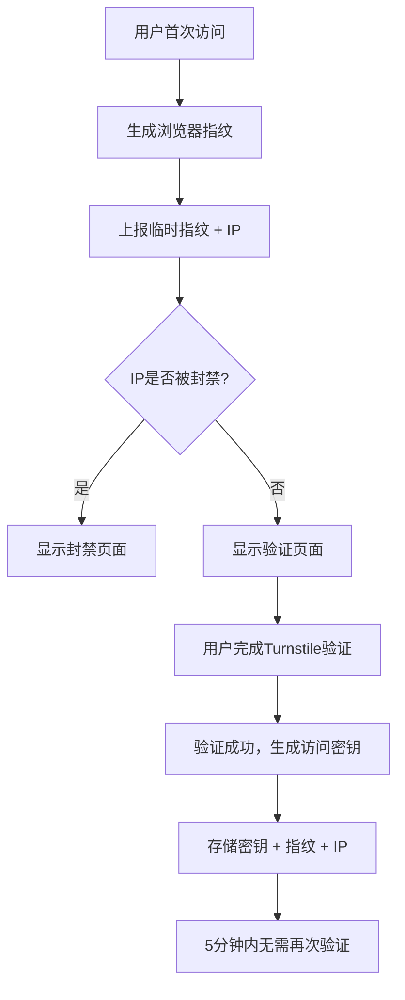
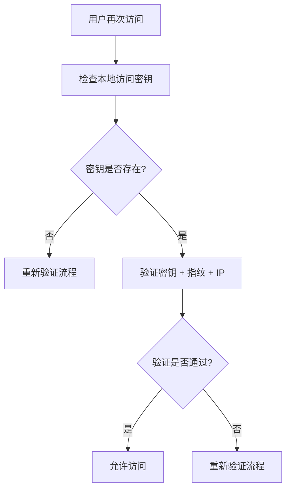
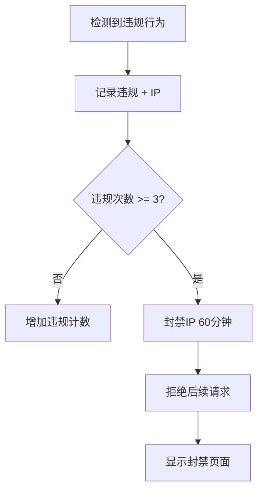

# IP封禁系统实现 - 增强的安全防护机制

## 功能概述

我们实现了一个完整的IP封禁系统，用于防止恶意访问和自动化攻击。系统同时存储用户的IP地址、访问密钥和用户指纹，确保三者匹配才能通过验证，如果任意一项发生变化或违规次数过多，将自动封禁客户端IP。

## 核心特性

### 🔒 三重验证机制

- **IP地址**: 记录用户访问时的IP地址
- **访问密钥**: 5分钟内有效的临时访问令牌
- **用户指纹**: 基于浏览器特征的唯一标识

### ⚡ 智能封禁策略

- **违规计数**: 记录每个IP的违规次数
- **自动封禁**: 超过3次违规自动封禁60分钟
- **递增惩罚**: 违规次数越多，封禁时间越长

### 🛡️ 安全防护

- **实时检测**: 每次请求都验证IP封禁状态
- **自动清理**: 定时清理过期的封禁记录
- **管理员控制**: 支持手动解除封禁

## 技术实现

### 后端架构

#### 1. 数据模型

**AccessToken模型** (`src/models/accessTokenModel.ts`)

```typescript
interface AccessTokenDoc {
  token: string;
  fingerprint: string;
  ipAddress: string; // 新增：存储用户IP地址
  createdAt: Date;
  updatedAt: Date;
  expiresAt: Date; // 5分钟后过期
}
```

**IP封禁模型** (`src/models/ipBanModel.ts`)

```typescript
interface IpBanDoc {
  ipAddress: string;
  reason: string;
  violationCount: number; // 违规次数
  bannedAt: Date;
  expiresAt: Date; // 封禁到期时间
  fingerprint?: string; // 关联的指纹
  userAgent?: string; // 用户代理
}
```

#### 2. 核心服务

**TurnstileService** (`src/services/turnstileService.ts`)

```typescript
export class TurnstileService {
  private static readonly MAX_VIOLATIONS = 3; // 最大违规次数
  private static readonly BAN_DURATION = 60 * 60 * 1000; // 封禁时长：60分钟

  // 检查IP是否被封禁
  public static async isIpBanned(ipAddress: string): Promise<{
    banned: boolean;
    reason?: string;
    expiresAt?: Date;
  }>;

  // 记录违规并可能封禁IP
  public static async recordViolation(
    ipAddress: string,
    reason: string,
    fingerprint?: string,
    userAgent?: string
  ): Promise<boolean>;

  // 验证访问密钥（必须匹配token、fingerprint和ipAddress）
  public static async verifyAccessToken(
    token: string,
    fingerprint: string,
    ipAddress: string
  ): Promise<boolean>;
}
```

#### 3. 定时清理

**SchedulerService** (`src/services/schedulerService.ts`)

```typescript
private async cleanupExpiredData(): Promise<void> {
  // 清理过期的临时指纹
  const fingerprintCount = await TurnstileService.cleanupExpiredFingerprints();

  // 清理过期的访问密钥
  const accessTokenCount = await TurnstileService.cleanupExpiredAccessTokens();

  // 清理过期的IP封禁记录
  const ipBanCount = await TurnstileService.cleanupExpiredIpBans();
}
```

### 前端实现

#### 1. 指纹工具

**fingerprint.ts** (`frontend/src/utils/fingerprint.ts`)

```typescript
// 验证访问密钥
export const verifyAccessToken = async (
  token: string,
  fingerprint: string
): Promise<boolean> => {
  try {
    const response = await fetch(
      `${getApiBaseUrl()}/api/turnstile/verify-access-token`,
      {
        method: "POST",
        headers: { "Content-Type": "application/json" },
        body: JSON.stringify({ token, fingerprint }),
      }
    );

    if (!response.ok) {
      const errorData = await response.json().catch(() => ({}));
      if (response.status === 403 && errorData.error === "IP已被封禁") {
        console.error(`IP已被封禁: ${errorData.reason}`);
        return false;
      }
      return false;
    }

    const data = await response.json();
    return data.success && data.valid;
  } catch (error) {
    console.error("验证访问密钥失败:", error);
    return false;
  }
};
```

#### 2. 首次访问检测Hook

**useFirstVisitDetection.ts** (`frontend/src/hooks/useFirstVisitDetection.ts`)

```typescript
interface UseFirstVisitDetectionReturn {
  isFirstVisit: boolean;
  isVerified: boolean;
  isLoading: boolean;
  error: string | null;
  fingerprint: string | null;
  isIpBanned: boolean; // 新增：IP封禁状态
  banReason?: string; // 新增：封禁原因
  banExpiresAt?: Date; // 新增：封禁到期时间
  checkFirstVisit: () => Promise<void>;
  markAsVerified: () => void;
}
```

#### 3. 验证组件

**FirstVisitVerification.tsx** (`frontend/src/components/FirstVisitVerification.tsx`)

```typescript
interface FirstVisitVerificationProps {
  onVerificationComplete: () => void;
  fingerprint: string;
  isIpBanned?: boolean; // 新增：IP封禁状态
  banReason?: string; // 新增：封禁原因
  banExpiresAt?: Date; // 新增：封禁到期时间
}
```

## 工作流程

### 1. 首次访问流程



### 2. 后续访问流程



### 3. 违规处理流程



## API接口

### 公共接口

#### 1. 临时指纹上报

```http
POST /api/turnstile/temp-fingerprint
Content-Type: application/json

{
  "fingerprint": "user_fingerprint_hash"
}
```

**响应示例**:

```json
{
  "success": true,
  "isFirstVisit": true,
  "verified": false
}
```

**封禁响应**:

```json
{
  "success": false,
  "error": "IP已被封禁",
  "reason": "Turnstile验证失败",
  "expiresAt": "2025-01-27T10:30:00.000Z"
}
```

#### 2. 验证临时指纹

```http
POST /api/turnstile/verify-temp-fingerprint
Content-Type: application/json

{
  "fingerprint": "user_fingerprint_hash",
  "cfToken": "turnstile_token"
}
```

#### 3. 验证访问密钥

```http
POST /api/turnstile/verify-access-token
Content-Type: application/json

{
  "token": "access_token",
  "fingerprint": "user_fingerprint_hash"
}
```

### 管理员接口

#### 1. 获取IP封禁统计

```http
GET /api/turnstile/ip-ban-stats
Authorization: Bearer <admin_token>
```

**响应示例**:

```json
{
  "success": true,
  "stats": {
    "total": 15,
    "active": 8,
    "expired": 7
  }
}
```

#### 2. 手动解除IP封禁

```http
POST /api/turnstile/unban-ip
Authorization: Bearer <admin_token>
Content-Type: application/json

{
  "ipAddress": "192.168.1.100"
}
```

#### 3. 手动清理过期数据

```http
POST /api/turnstile/manual-cleanup
Authorization: Bearer <admin_token>
```

## 安全特性

### 1. 输入验证

- **IP地址验证**: 支持IPv4和IPv6格式验证
- **指纹验证**: 长度和格式检查
- **令牌验证**: 长度和内容安全检查

### 2. 数据清理

- **自动TTL**: 使用MongoDB TTL索引自动清理过期数据
- **定时清理**: 每5分钟清理过期记录
- **手动清理**: 管理员可手动触发清理

### 3. 错误处理

- **优雅降级**: 数据库连接失败时的处理
- **详细日志**: 记录所有操作和错误
- **用户友好**: 清晰的错误提示

## 性能优化

### 1. 数据库索引

```typescript
// 复合索引，用于快速查询
AccessTokenSchema.index({ token: 1, fingerprint: 1, ipAddress: 1 });
AccessTokenSchema.index({ fingerprint: 1, ipAddress: 1, expiresAt: 1 });
AccessTokenSchema.index({ ipAddress: 1, expiresAt: 1 });

// TTL索引，自动清理过期数据
AccessTokenSchema.index({ expiresAt: 1 }, { expireAfterSeconds: 0 });
```

### 2. 缓存策略

- **本地存储**: 前端缓存访问密钥
- **自动过期**: 5分钟后自动失效
- **定期清理**: 清理过期的本地缓存

### 3. 请求优化

- **批量操作**: 定时清理时批量删除
- **异步处理**: 非阻塞的清理操作
- **错误重试**: 网络请求失败时的重试机制

## 监控和日志

### 1. 操作日志

```typescript
logger.info("访问密钥生成成功", {
  fingerprint: validatedFingerprint.substring(0, 8) + "...",
  ipAddress: validatedIp,
  expiresAt,
});

logger.warn(`IP ${validatedIp} 违规次数增加到 ${banDoc.violationCount}`, {
  reason,
  fingerprint: fingerprint?.substring(0, 8) + "...",
  banned: banDoc.violationCount >= this.MAX_VIOLATIONS,
});
```

### 2. 统计信息

- **总封禁数**: 历史封禁记录总数
- **活跃封禁**: 当前有效的封禁数量
- **过期封禁**: 已过期的封禁记录数
- **清理统计**: 定时清理的数据量

## 使用示例

### 1. 正常访问流程

```typescript
// 1. 检查首次访问
const { isFirstVisit, isVerified, isIpBanned } = useFirstVisitDetection();

// 2. 如果IP被封禁，显示封禁页面
if (isIpBanned) {
  return <IpBanPage reason={banReason} expiresAt={banExpiresAt} />;
}

// 3. 如果是首次访问，显示验证页面
if (isFirstVisit && !isVerified) {
  return <FirstVisitVerification onComplete={markAsVerified} />;
}

// 4. 正常访问应用
return <MainApp />;
```

### 2. 管理员操作

```typescript
// 获取封禁统计
const response = await fetch("/api/turnstile/ip-ban-stats", {
  headers: { Authorization: `Bearer ${adminToken}` },
});
const { stats } = await response.json();

// 解除IP封禁
await fetch("/api/turnstile/unban-ip", {
  method: "POST",
  headers: {
    Authorization: `Bearer ${adminToken}`,
    "Content-Type": "application/json",
  },
  body: JSON.stringify({ ipAddress: "192.168.1.100" }),
});
```

## 配置选项

### 1. 封禁参数

```typescript
export class TurnstileService {
  private static readonly MAX_VIOLATIONS = 3; // 最大违规次数
  private static readonly BAN_DURATION = 60 * 60 * 1000; // 封禁时长：60分钟
}
```

### 2. 清理间隔

```typescript
class SchedulerService {
  this.cleanupInterval = setInterval(() => {
    this.cleanupExpiredData();
  }, 5 * 60 * 1000); // 每5分钟执行一次
}
```

### 3. 访问密钥有效期

```typescript
const expiresAt = new Date(Date.now() + 5 * 60 * 1000); // 5分钟后过期
```

## 总结

IP封禁系统为我们的应用提供了强大的安全防护能力：

### ✅ 已实现功能

- **三重验证**: IP + 指纹 + 访问密钥
- **智能封禁**: 基于违规次数的自动封禁
- **实时检测**: 每次请求都验证封禁状态
- **自动清理**: 定时清理过期数据
- **管理员控制**: 手动解除封禁功能
- **用户友好**: 清晰的封禁提示页面

### 🔮 未来扩展

- **白名单机制**: 支持IP白名单
- **地理位置封禁**: 基于地理位置的封禁
- **行为分析**: 基于用户行为的智能封禁
- **通知系统**: 封禁事件的通知机制
- **数据分析**: 封禁数据的可视化分析

这个系统有效防止了自动化攻击和恶意访问，同时保持了良好的用户体验和系统性能。

---

**相关链接**

- [Turnstile 官方文档](https://developers.cloudflare.com/turnstile/)
- [MongoDB TTL 索引](https://docs.mongodb.com/manual/core/index-ttl/)
- [React Hook 最佳实践](https://reactjs.org/docs/hooks-custom.html)
